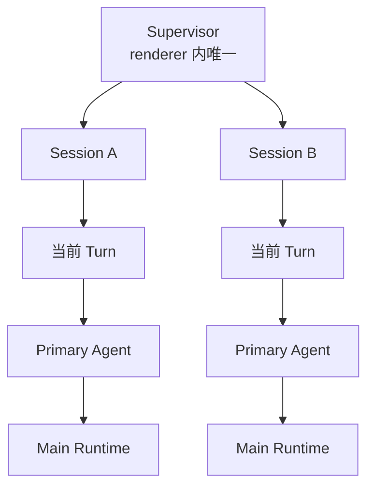
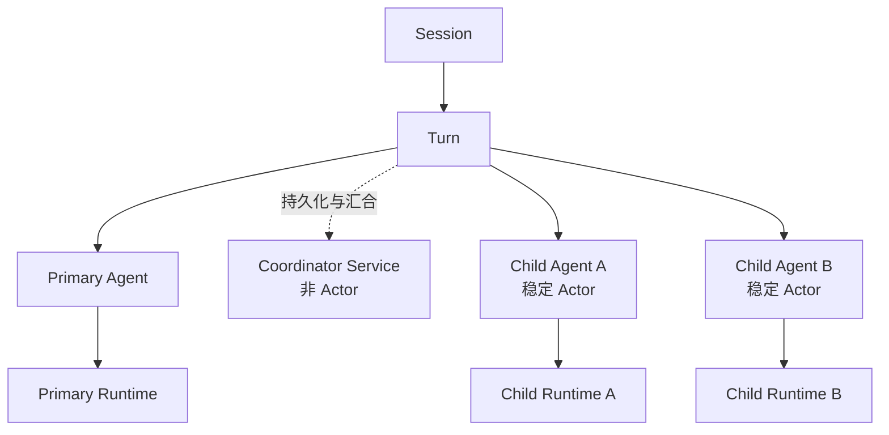

# Chat 多会话与多 Agent 接入指南

## 文档定位

本文描述 Chat 在未来接入多会话并行和多 Agent 协作时的推荐演进路径。它是扩展约束，不代表这些能力已经全部实现。

当前架构事实以 [ChatRuntime 架构图](chat-runtime-architecture-map.md) 为准。扩展时应保留当前已经稳定的边界：

- 主进程拥有 Runtime 执行、消息持久化、同会话写锁、工具执行和等待中的请求。
- 渲染进程拥有 Actor 状态、UI 订阅、用户决策和只能从界面获取的能力。
- Runtime 启动前，渲染进程先分配 `runtimeId`，再注册 Actor 地址与 capability，最后发起 IPC。
- Runtime 事件只由应用级监听器接收，再按 `runtimeId` 路由到 Session、Turn 和 Agent。
- 切换会话或卸载 `BChat` 不等于取消任务。

## 当前基线

当前 Actor 层级是：



当前能力和限制如下：

| 范围         | 当前行为                                                                                    |
| ------------ | ------------------------------------------------------------------------------------------- |
| Supervisor   | 可以持有多个 Session actor。                                                                |
| Session      | 同一时间只持有一个活动 Turn。                                                               |
| Turn         | 只持有一个 `primaryAgentRef`。                                                              |
| Agent        | 同一 Agent 生命周期只关联一个活动 Runtime。                                                 |
| 主进程并发   | 不同 Session 可以并行；`send`、`continue` 和用户选择续跑在同一 Session 内受写锁保护。       |
| Runtime 路由 | `runtimeId` 映射到完整 `ChatRuntimeAddress`，包含 root、parent 与 continuation 谱系。       |
| Runtime 恢复 | 普通活动 Runtime 可恢复待处理请求；Agent Checkpoint 另以持久化投影恢复原 Turn 等待状态。    |
| UI 订阅      | 应用级监听器始终接收 Runtime 事件；可见 `BChat` 只订阅所属 Session 的 UI 事件。             |

这意味着多会话底层隔离和默认关闭的一层只读 Child 闭环已经存在；会话列表状态、后台任务提示、轻量任务卡片与受控写入仍需后续接入。

## 不变式

未来扩展必须继续满足以下不变式：

1. **主进程是执行和消息持久化的事实来源。** Renderer 不创建一套并行的 Runtime 消息真相。
2. **所有异步事件都按稳定地址路由。** 不允许根据“当前打开的会话”猜测事件归属。
3. **Runtime capability 按 `runtimeId` 隔离。** 工具、文档上下文和 bridge 能力在启动时冻结；普通 Runtime 恢复后只能按匹配描述符重挂既有 renderer handle，不能改变已声明能力。
4. **会话切换不终止后台任务。** 只有明确的取消命令可以停止 Runtime。
5. **同一消息只能有一个写入者。** 子 Agent 不直接修改 Primary 正在流式更新的 assistant 消息。
6. **并发写入必须先有冲突模型。** 在锁粒度、分支和合并策略明确前，不允许同一 Session 内多个写 Runtime 并行。

## 多会话接入

### 目标体验

多会话接入不是简单地多开几个 `BChat`。用户需要在不切换页面的情况下知道后台会话正在做什么，并能可靠地取消、恢复或删除它们。

会话列表至少应显示：

- `idle`：可输入。
- `preparing` 或 `running`：正在执行。
- `waitingForUser`：等待确认或用户选择。
- `cancelling`：正在取消。
- `failed`：最近一次 Turn 失败。

后台会话完成、等待用户或失败时，可以更新列表状态或系统通知，但不应自动切换当前会话。

### 状态来源

会话列表不要订阅每一条消息的完整事件。推荐从 Supervisor 中的 Session actor 快照派生轻量摘要：

```ts
/** 未来建议的会话运行摘要，不是当前已存在的类型。 */
interface ChatSessionRuntimeSummary {
  sessionId: string;
  status: 'idle' | 'preparing' | 'running' | 'waitingForUser' | 'cancelling' | 'failed';
  activeRuntimeId?: string;
  waitingReason?: 'userChoice' | 'confirmation';
  updatedAt: string;
  errorMessage?: string;
}
```

消息列表仍由会话数据存储负责；Actor 摘要只表达流程状态，不复制消息内容。

### 创建与切换

1. 创建持久化会话后，调用 `actorSystem.ensureSession(sessionId)` 创建或取得 Session actor。
2. `BChat` 切换到该会话时，只替换 Session UI 事件订阅和消息数据源。
3. 全局 Runtime 事件监听保持不变，不能随 `BChat` 挂载和卸载重复注册。
4. 命令始终显式携带 `sessionId` 或 `runtimeId`，不能依赖全局 `activeSessionId` 推导后台任务目标。

### 并发规则

当前主进程写锁以 `sessionId` 为粒度，因此：

- Session A 和 Session B 可以同时运行。
- 普通发送、继续生成和用户选择续跑不能在同一 Session 内重叠，冲突时主进程返回 `SESSION_BUSY`。
- 手动压缩当前会登记活动 Runtime，但没有复用 Session 写锁。接入后台多会话前，应明确“运行中禁止手动压缩”或让 compact 进入同一锁协议。
- UI 收到 `SESSION_BUSY` 时，应刷新错误所属 Session 的状态，而不是把错误归到当前可见会话。

### 删除会话

删除带活动 Runtime 的会话必须是显式策略，推荐流程是：

1. 查询该 Session 是否存在活动 Runtime。
2. 提示用户“取消任务并删除”，或阻止删除。
3. 逐个取消该 Session 的 Runtime，并等待主进程释放锁。
4. 清理 Runtime 路由、capability、Session actor 和持久化数据。

不应只移除侧边栏项目而让主进程 Runtime 继续写入一个已删除会话。

### Renderer 重载恢复

应用启动时继续通过 `src/hooks/useChat/useRuntimeRecovery.ts` 获取活动 Runtime。多会话恢复应遵循：

- 按 `sessionId` 独立创建 Session actor。
- 先恢复 Actor 地址和持久化 capability 描述符，计算降级后的有效能力，再重放待处理 renderer 请求。
- 可见 `BChat` 挂载后，只重挂属于该会话且描述符匹配的 renderer capability handle，不改写声明能力。
- 同一 Session 若返回多个活动写 Runtime，应视为主进程约束被破坏并记录错误，不能静默覆盖。

## 多 Agent 接入

### 第一阶段选择

当前已完成**默认关闭的一层只读 Child**。首阶段保持写能力关闭，并按 resource scope 最多并发 3 个彼此兼容的纯读任务：

- Primary 负责规划、派发和最终回复。
- Child Agent 不能继续委派；同一 Turn 最多只有一层 Child。
- Coordinator 只并发调度 resource scope 兼容的 `pure_read` 任务，任一时刻最多 3 个；冲突范围必须排队。
- 所有写工具、外部副作用和 commit adapter 在这一阶段保持禁用。
- Child Agent 默认不直接生成用户可见消息。
- Primary 消费结果后继续执行或形成最终回答。

真实 SQLite/Runtime 回归已覆盖三个 Child 以 2、3、1 顺序完成后，按原 tool-call 顺序汇合并只启动一个 Primary Runtime B；并发仍限制在无副作用范围内。

### Actor 与 Coordinator 服务职责

不要为了 Main-owned Child 改写 Renderer 中只表达用户可见 Primary 的 `primaryAgentRef`。`ChatAgentDelegationService` 与 `AgentCoordinator` 是主进程服务职责，不是 Actor，也不是可替换 Runtime；稳定 Child Actor 由独立 Registry 按 Task 注册，具体 Runtime 地址按 Attempt 临时绑定：



职责划分：

| 组件/身份           | 职责                                                       |
| ------------------- | ---------------------------------------------------------- |
| Session Actor       | 一个会话的输入门禁、当前 Turn、取消和回滚。                |
| Turn Actor          | 一个用户意图的总生命周期，决定何时整体完成。               |
| Primary Agent Actor | 用户可见的主要推理和最终回答。                             |
| Coordinator Service | 校验受限契约、冻结计划、调度 Attempt、汇合结果和请求续接。 |
| Child Agent Actor   | Registry 中绑定一个不可变 Task 身份，跨 Runtime 保持稳定。  |
| Runtime             | Attempt 的可替换执行实例；结束后解绑，不等同 Task 或 Actor。 |

feature flag 关闭或 Primary 未委派时，普通聊天继续保持简单路径，不创建 Coordinator 工作。基本原则是：Task 是身份，Attempt 是执行，Event 是历史，Runtime 是可替换实例。

### Runtime 地址协议

共享 `ChatRuntimeAddress` 已包含完整谱系：

```ts
interface ChatRuntimeAddress {
  sessionId: string;
  turnId: string;
  agentId: string;
  runtimeId: string;
  parentAgentId?: string;
  parentRuntimeId?: string;
  rootRuntimeId: string;
  continuationOfRuntimeId?: string;
}
```

字段语义：

- `turnId`：把重载前后的 Runtime 放回同一个 Turn。
- `agentId`：Agent 在 Turn 内的稳定标识。
- `parentAgentId`：Actor 层级关系。
- `parentRuntimeId`：执行派生关系，表示哪个 Runtime 发起了当前 Runtime。
- `rootRuntimeId`：快速聚合同一次 Turn 的 Runtime 树。
- `continuationOfRuntimeId`：同一 Actor 的上一个 Runtime。Primary Runtime B 的 `parentRuntimeId` 与 `continuationOfRuntimeId` 都指向挂起的 Runtime A。

`parentRuntimeId` 不能替代 `parentAgentId`。Agent 可能续跑多个 Runtime，Renderer 重载后也不能仅靠当前活动 Runtime 推断稳定 Actor 父子关系。

### 当前 deferred-coordination 生命周期

当前只有 registry 中 `executionClass: 'deferred-coordination'` 的 `delegate_task` 可产生 suspension，且只允许主进程受信任路径使用。完整基础闭环是：

1. Runtime A 完整解析一个只读 `delegate_task`，不生成 renderer-tool 请求。
2. 同一 SQLite 事务提交 source assistant、不可变 Task Contract、Checkpoint、Event 和 Outbox。
3. 事务提交后 Checkpoint 进入 `waiting_children`；Runtime A 的短时消息写锁释放，但 Session history continuation fence（`RuntimeContinuationFence`）保留。
4. Coordinator 编译 capability intersection、预留预算并取得共享读 lease；Child executor 使用冻结 Primary 模型和最小任务包执行本地纯读工具，不写普通消息。
5. Child 通过内部 `recordTaskResult` 写入已验证结果。全部 required Task 终态后，Checkpoint 在事务内进入 `ready_to_resume`，同时创建事件类型为 `delegation.ready` 的 Outbox。
6. Checkpoint 版本 CAS 只允许一个 Primary Runtime B；Runtime B 使用冻结模型身份、禁用工具、`forceFinal`，并按原 `toolCallId` 注入结构化结果。
7. Runtime B 安全终态化后释放 fence。无法证明 assistant 已安全持久化的 rejection 会保留 `resuming` 与 fence，等待恢复处理。

Renderer 重载不等于主进程重启。前者通过 `chatAgentListActive` 恢复 `waitingChildren` 投影，并保留 Runtime A 的未完成 assistant；Agent 状态查询失败时也不执行破坏性草稿恢复。后者丢失 continuation context，启动时在 IPC 开放前把无法恢复的活动 Checkpoint 收敛为 `interrupted`，绝不猜测或重放 Provider 模型调用。

Outbox 先交付 Main 内部消费者，再发布 Renderer 投影并确认 delivered。`delegation.created` 会幂等进入 Coordinator；同一进程的 pending Outbox 可重投，主进程启动时只重放仍满足持久化状态的 eligible 事件。

### 当前禁用边界

- `delegate_task` 的 exposure 仍为 `internal`，BChat 默认工具集不含它。
- feature flag 默认关闭；公开 `send()` 在取得锁和写消息前拒绝 Renderer 提供的 deferred 工具、伪 Child 身份和内部 lineage，再由 Main 按固定只读策略注入可信定义。
- 首阶段 Child capability 只可能包含 `glob`、`grep`、`read_directory`、`read_file` 的收缩交集；`delegate_task`、`external_read`、写工具、Renderer bridge 和 provider-supplied 本地结果均 fail closed。
- 当前没有 Child transcript API、任务卡片、写入 adapter、ConfirmationQueue 或 commit journal。
- 当前专用 deferred parser 只接受 `delegate_task`；新增其他协调工具必须单独设计契约与持久化协议。

### 结果与消息归属

`types/chat-agent.d.ts` 已定义结构化 `ChatAgentResult`，把执行状态、完成度、验证证据、机器错误、artifact ownership/visibility 和 usage/cost 分开。Child 不应直接向用户消息流追加 assistant 消息。

建议的可见性规则：

- Primary 的 user/assistant 消息属于正常聊天历史。
- Child 的过程消息默认内部可见，可存成独立 Agent 记录或带明确可见性元数据的消息。
- Child 结果由 Coordinator 交给 Primary，Primary 决定摘要、引用或继续派发。
- 若产品要展示“子 Agent 工作台”，它读取 Agent 记录，不复用主聊天气泡作为调度协议。

### 工具与 capability

每个 Runtime 必须拥有独立 capability 快照：

- Child 不能隐式使用当前可见编辑器的上下文。
- 文档能力必须绑定明确的 `documentId`，磁盘工具必须绑定明确的工作区和权限。
- Child 只获得完成子任务所需的工具，不继承 Primary 的全部工具。
- 普通 Runtime 在 Renderer 重载后可以按已持久化描述符重挂 renderer capability handle；描述符、文档和 Runtime 地址必须全部匹配，这只是恢复既有能力，不是为 Task 扩权。
- 需要用户确认的操作始终携带 `runtimeId`，决策返回原 Runtime。

Child 的能力恢复顺序固定为 `persisted capability → available capability → intersection → effective capability`，并满足：

```text
effective = persisted ∩ available ∩ role/policy
```

`effective` 对同一 Task/Attempt 只能单调收缩。环境重新出现不能让旧 Task 自动获得此前不可用或未授权的能力；确实需要新能力时，Primary 必须提交一个新 Task Contract。

当前只读 Child 不进入确认控制器。开放写 Child 前，需要把“单个当前确认”升级为按 Runtime 排队的请求集合，并在 UI 中显示请求来自哪个会话和 Agent。

### 取消与失败

需要区分三种取消：

| 操作               | 推荐语义                                                      |
| ------------------ | ------------------------------------------------------------- |
| 取消 Child Agent   | 只中止该 Child Runtime，由 Coordinator 决定重试、降级或继续。 |
| 取消 Turn          | 级联取消 Primary 和所有未完成 Child，然后等待全部终止。       |
| 删除或关闭 Session | 不自动取消；只有明确的“取消任务并删除”才级联终止。            |

Child 任务在派发时应声明 `required` 或 `optional`：

- `required` 失败会使 Turn 失败，或由 Primary 明确重试。
- `optional` 失败会作为结构化结果返回，Primary 可以继续回答。
- Turn 只有在 Primary 完成且所有 required Child 已进入终态后才能完成。

当前实现先持久化 Checkpoint/Task 的 `cancelling`，再由 Scheduler 向排队或运行中的 Child 传播 `AbortSignal`。运行中 executor 在宽限期后接收 hard abort，Primary cancel 使用有界等待；只有安全终态才关闭 source assistant 并释放 Runtime、lease、预算和 fence。首阶段 Child 是进程内 Runtime，不伪造进程级强制终止。

更高层 Session 删除与跨 Checkpoint Turn 取消仍应复用该顺序：先持久化级联取消意图，再等待 required Child/Attempt 各自进入可证明终态；IPC 已响应不代表 Child 已停止。

## 真正并行前的前置条件

并行只读 Child Agent 可以较早开放，但同 Session 并行写入必须先完成以下设计：

1. 将主进程锁从单一 Session 写锁细化为可表达读写意图的锁协议。
2. 为文档或工作区写入定义冲突域，不能只比较工具名。
3. 为多个 Agent 的消息、文件和编辑结果定义分支与合并策略。
4. 确认请求、bridge 请求和 renderer 工具请求能按 Runtime 并发排队和恢复。
5. 定义父 Agent 提前完成、失败或取消时对子 Runtime 的级联规则。

在这些条件完成前，可以并行执行完全隔离、无副作用的读取或分析任务；任何写工具仍需串行。

## 分阶段实施

### 阶段 0：补齐多会话产品层

- 会话列表接入 Session actor 摘要。
- 显示后台运行、等待确认、失败和完成状态。
- 会话切换不影响全局监听和 Runtime 生命周期。
- 删除活动会话执行明确的取消策略。

### 阶段 1：一层并行只读 Child（已完成）

- 复用现有 Coordinator Service，增加按需创建的一层 Child Actor 与专用执行器。
- 复用现有 Task Contract 和 `ChatAgentResult`，编译只读 Execution Plan 与 capability intersection。
- 以 resource scope 为调度门禁，最多并发 3 个彼此兼容的纯读 Child Runtime；Child 不得继续委派。
- 禁用所有写工具、外部副作用、ConfirmationQueue 和 commit adapter。
- Primary 聚合 Child 结果并生成唯一用户可见回复。

### 阶段 2：可恢复交互与任务投影

- 在现有 Task/Attempt/Event 与 Runtime 地址上增加轻量任务卡片投影，不引入重复 `role` 字段或 Child transcript。
- Renderer 重载从公开 Checkpoint/Event 恢复展示，Main Registry 继续持有 Actor/Runtime，Coordinator 仍是服务职责。
- 待确认、bridge 和 renderer 工具请求按 Runtime 恢复。

### 阶段 3：扩展并行只读调度

- Coordinator 在首阶段 3 个并发上限的基础上支持可配置资源配额和最大子任务数。
- capability 标注读写级别，并只并行无副作用工具。
- 处理乱序完成、局部失败、取消和超时。

### 阶段 4：受控并行写入

- 引入资源级锁或隔离分支。
- 提供冲突检测、合并和回滚。
- UI 明确展示待合并变更及其 Agent 来源。

## 测试清单

### 多会话

- 不同 Session 的 Runtime 可以同时运行，事件不会串会话。
- 同一 Session 的第二个 send、continue 或用户选择续跑 Runtime 被稳定拒绝。
- 手动 compact 与活动生成的并发策略有明确测试，不会同时改写同一会话历史。
- 切换或卸载 `BChat` 后后台 Runtime 继续，重新进入后状态正确。
- Renderer 重载后，各 Session 的活动 Runtime 和待确认请求分别恢复。
- 删除活动会话不会遗留 Runtime、路由、capability 或写锁。

### 多 Agent

- Child Runtime 在 IPC 前完成地址和 capability 注册。
- Child 完成顺序变化不会改变结果归属。
- Primary 不会被 Child 事件误标为完成或失败。
- Turn 取消会级联到所有未完成 Child。
- optional Child 失败不阻断 Turn，required Child 失败遵守策略。
- capability 不会跨 Agent、文档或 Runtime 泄漏。
- 重载后能恢复原 `turnId`、父子 Agent 和待处理请求。
- 同 Session 并行写入在功能开放前始终被拒绝。

## 禁止的捷径

- 不在组件中新增第二套全局 Runtime 事件监听。
- 不用当前可见 `sessionId`、编辑器或 Tab 推断后台 Runtime 上下文。
- 不让 Child Agent 直接修改 Primary 的 assistant 草稿。
- 不共享可变工具数组或动态“当前文档”闭包作为跨 Runtime capability。
- 不仅凭 `parentRuntimeId` 重建 Agent 树。
- 不在缺少冲突与合并协议时绕过 Session 写锁。
- 不为了尚未实现的并行能力提前把简单的 Primary 路径抽象成通用调度框架。

## 相关文件

- `src/ai/chat/actorSystem.ts`
- `src/ai/chat/machine/supervisorMachine.ts`
- `src/ai/chat/machine/sessionMachine.ts`
- `src/ai/chat/machine/turnMachine.ts`
- `src/ai/chat/machine/agentMachine.ts`
- `src/hooks/useChat/useRuntimeEvents.ts`
- `src/hooks/useChat/useRuntimeRecovery.ts`
- `src/hooks/useChat/useAgentDelegationEvents.ts`
- `src/components/BChat/hooks/useChatRuntimeLauncher.ts`
- `electron/main/modules/chat/agents/contracts.mts`
- `electron/main/modules/chat/agents/result.mts`
- `electron/main/modules/chat/agents/store.mts`
- `electron/main/modules/chat/agents/service.mts`
- `electron/main/modules/chat/agents/ipc.mts`
- `electron/main/modules/chat/runtime/service.mts`
- `electron/main/modules/chat/runtime/infrastructure/locks.mts`
- `types/chat-agent.d.ts`
- `types/chat-runtime.d.ts`
