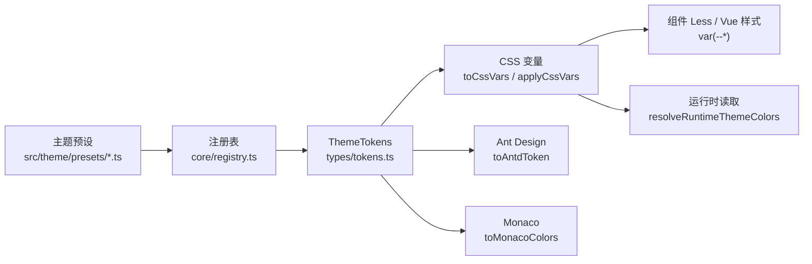

# 主题开发指南

## 一句话模型

`src/theme` 是 Tibis 的主题单一事实源。主题预设只负责提供 `ThemeTokens`，运行时再把同一份 token 派生成 CSS 变量、Ant Design 主题配置、Monaco 颜色和少量 DOM 可读的运行时颜色。

开发主题时优先思考两件事：

1. 当前改动是新增一套预设，还是扩展所有主题都必须支持的 token。
2. 新 token 是否需要同时落到 CSS 变量、Ant Design、Monaco、运行时读取和测试。

## 核心链路



`ThemeMode` 和 `themePreset` 是正交概念：

| 配置          | 职责                                                                     |
| ------------- | ------------------------------------------------------------------------ |
| `ThemeMode`   | 决定使用 `light`、`dark`，或按系统偏好解析明暗模式。                     |
| `themePreset` | 决定使用哪套预设色值，例如 `default`、`classic`、`shonen`、`overworld`。 |

因此 `theme=system` 只影响 mode 解析，不会改变 preset 选择。

## 目录职责

| 路径                         | 职责                                                                |
| ---------------------------- | ------------------------------------------------------------------- |
| `src/theme/index.ts`         | 主题模块入口。先导入所有内置预设触发注册，再导出公开 API。          |
| `src/theme/types/tokens.ts`  | `ThemeTokens` 完整结构。新增全局 token 必须从这里开始。             |
| `src/theme/types/custom.ts`  | 持久化自定义主题配置结构。                                          |
| `src/theme/core/registry.ts` | 主题注册、列表查询、fallback 和自定义主题注册。                     |
| `src/theme/core/factory.ts`  | 从 `BasePalette` 派生完整 `ThemeTokens`，并提供覆盖能力。           |
| `src/theme/core/derive.ts`   | 从 `ThemeTokens` 派生 CSS 变量、Ant Design token 和 Monaco colors。 |
| `src/theme/core/apply.ts`    | 校验 token 格式，并把 CSS 变量注入到 `:root`。                      |
| `src/theme/core/runtime.ts`  | 从 DOM 已注入变量读取运行时主题色。                                 |
| `src/theme/presets/*.ts`     | 内置主题预设。每个文件负责注册自己。                                |

## 新增主题预设

### 1. 选择实现方式

优先使用 `createThemeTokens(basePalette, mode, overrides)`。它能从约 30 个基础色派生完整 token，适合大多数颜色主题。

只有在以下场景才手写完整 `ThemeTokens`：

- 默认主题需要非常精细地还原现有界面层级。
- 某个主题的语义和派生规则差异过大，用 overrides 反而更难读。
- 主题必须逐项控制编辑器、按钮、输入框等所有细节。

当前示例：

| 预设                 | 实现方式                       | 说明                                     |
| -------------------- | ------------------------------ | ---------------------------------------- |
| `default` / Graphite | 手写完整 `ThemeTokens`         | 默认柔和黑白主题，对界面层级要求最精细。 |
| `classic`            | 手写完整 `ThemeTokens`         | 保留旧默认暖米白色值。                   |
| `shonen`             | `BasePalette` 派生             | 典型基础色板主题。                       |
| `overworld`          | `BasePalette` 派生 + overrides | 在颜色外覆盖圆角、边框、字体和硬阴影。   |

### 2. 创建预设文件

在 `src/theme/presets/` 新建一个语义清晰的文件，例如 `aurora.ts`。文件需要：

- 顶部文件说明注释。
- 明确声明 light 和 dark 色板或 token。
- 调用 `registerPreset` 注册。
- `id` 使用稳定小写 kebab-case。
- `label` 使用用户可见名称，保持与设置页主题选择器一致。

基础色板预设示例：

```ts
/**
 * @file aurora.ts
 * @description Aurora 极光主题预设，使用冷绿色主色和柔和暗色背景。
 */
import type { BasePalette } from '../core/factory';
import { createThemeTokens } from '../core/factory';
import { registerPreset } from '../core/registry';

/**
 * Aurora 亮色基础色板。
 */
const auroraLight: BasePalette = {
  bg0: '#f8fbfa',
  bg1: '#edf5f2',
  bg2: '#e1ece8',
  bg3: '#ffffff',
  bg4: '#cfddd8',
  fg0: '#14201c',
  fg1: '#40524b',
  fg2: '#74867f',
  red: '#d85c5c',
  green: '#2f8f6a',
  yellow: '#b58125',
  blue: '#2f6f9f',
  purple: '#7860b8',
  orange: '#c87335',
  cyan: '#2a9aa8',
  syntaxComment: '#74867f',
  syntaxKeyword: '#2f6f9f',
  syntaxString: '#2f8f6a',
  syntaxFunction: '#7860b8',
  syntaxNumber: '#b58125',
  syntaxType: '#2a9aa8',
  syntaxVariable: '#14201c',
  syntaxOperator: '#40524b',
  syntaxTag: '#2f6f9f',
  syntaxAttribute: '#7860b8',
  accent: '#2f8f6a',
  border: '#c9d8d2',
  selectionBg: '#cfeadf'
};

/**
 * Aurora 暗色基础色板。
 */
const auroraDark: BasePalette = {
  bg0: '#101716',
  bg1: '#182321',
  bg2: '#20302c',
  bg3: '#293b36',
  bg4: '#344b44',
  fg0: '#eef8f4',
  fg1: '#bfd3cc',
  fg2: '#849b93',
  red: '#ff8a8a',
  green: '#76e0ad',
  yellow: '#e7bd63',
  blue: '#82b7ff',
  purple: '#b6a0ff',
  orange: '#ffad76',
  cyan: '#76dce8',
  syntaxComment: '#849b93',
  syntaxKeyword: '#82b7ff',
  syntaxString: '#76e0ad',
  syntaxFunction: '#b6a0ff',
  syntaxNumber: '#e7bd63',
  syntaxType: '#76dce8',
  syntaxVariable: '#eef8f4',
  syntaxOperator: '#bfd3cc',
  syntaxTag: '#82b7ff',
  syntaxAttribute: '#b6a0ff',
  accent: '#76e0ad',
  border: '#38534c',
  selectionBg: '#244f3d'
};

registerPreset({
  id: 'aurora',
  label: '极光绿「Aurora」',
  light: createThemeTokens(auroraLight, 'light'),
  dark: createThemeTokens(auroraDark, 'dark')
});
```

### 3. 在入口注册

把新预设加入 `src/theme/index.ts` 的副作用导入列表：

```ts
import './presets/aurora';
```

注册顺序会影响 `getPresetList()` 的展示顺序，但 `default` 始终排第一。

### 4. 更新测试

新增预设至少补充：

- `test/theme/preset-list.test.ts`：确认预设出现在 `getPresetList()` 中，并能解析 light/dark token。
- 必要时补充 CSS 变量断言，确认关键色或设计 token 派生正确。
- 如果改动了 Ant Design 映射，补充 `test/theme/antd-token.test.ts` 或 `test/theme/design-token-derive.test.ts`。
- 如果改动了 Monaco 映射，补充 `test/theme/monaco-selection.test.ts` 或相邻测试。
- 如果改动了运行时读取，补充 `test/theme/runtime.test.ts`。

常用验证命令：

```bash
pnpm exec vitest run test/theme
pnpm exec tsc --noEmit
```

提交前仍需按项目规范运行完整检查：

```bash
pnpm lint
pnpm lint:style
pnpm exec tsc --noEmit
```

## 扩展 ThemeTokens

新增全局 token 时按这个顺序改：

1. 在 `src/theme/types/tokens.ts` 增加字段和注释。
2. 在 `src/theme/core/factory.ts` 的派生结果中给出默认值。
3. 在所有手写完整 token 的预设中补齐字段。
4. 如需 CSS 变量，确认 `toCssVars()` 的默认 kebab-case 命名符合预期。
5. 如需特殊 CSS 变量前缀，在 `GROUP_PREFIX_MAP` 中显式维护兼容映射。
6. 如需参与 Ant Design，更新 `toAntdToken()`。
7. 如需参与 Monaco，更新 `toMonacoColors()`。
8. 如需运行时 JS 读取，更新 `resolveRuntimeThemeColors()` 及对应类型。
9. 更新测试和 changelog。

不要只在某个组件里临时增加一个 `var(--some-token)`。如果它表达的是跨组件语义，应进入 `ThemeTokens`；如果它只属于单个组件内部状态，可以保留为组件局部 CSS 变量。

## CSS 变量命名

`toCssVars()` 默认把 `ThemeTokens` 的 `group.propName` 转为：

```text
--group-prop-name
```

示例：

| Token                   | CSS 变量                    |
| ----------------------- | --------------------------- |
| `color.primaryBg`       | `--color-primary-bg`        |
| `input.focusBorder`     | `--input-focus-border`      |
| `button.primaryHoverBg` | `--button-primary-hover-bg` |
| `surface.borderWidth`   | `--surface-border-width`    |

两个历史兼容前缀需要特别注意：

| Token 组     | CSS 变量前缀 | 原因                       |
| ------------ | ------------ | -------------------------- |
| `richEditor` | `--editor-*` | 兼容现有编辑器 Less 引用。 |
| `usagePanel` | `--usage-*`  | 兼容现有用量面板样式引用。 |

尺寸类 token 会按 14px 设计基准从 px 转 rem，但 0 和 1px 会保留，避免发丝线变模糊。这个逻辑在 `isScalableToken()` 和 `convertPxToRem()` 中维护。

## Ant Design 映射

Ant Design 不直接消费 CSS 变量，而是通过 `toAntdToken(tokens, rootFontSize)` 生成配置：

- 全局 `colorBgContainer` 使用 `tokens.bg.secondary`，适合 Card/Table 等容器。
- 输入类组件的 `colorBgContainer` 使用 `tokens.input.bg` 或 `tokens.bg.primary`，维持输入区域层级。
- 下拉类组件的弹层背景使用 `tokens.dropdown.bg`。
- Drawer 的浮层背景使用 `tokens.bg.primary`，与页面主背景保持一致。
- 圆角、边框宽度、字号和控件高度会按根字号缩放。

如果新增 token 只影响项目自研组件，通常不需要改 `toAntdToken()`。只有当 Ant Design 组件也需要同一语义时，才把它映射进去。

## Monaco 映射

Monaco 主题由 `src/components/BMonaco/utils/createMonaco.ts` 按 preset 和 mode 懒注册。颜色来源是 `toMonacoColors(tokens)`。

注意：

- `sourceEditor` 负责 Markdown token 语法高亮语义。
- `monaco` 负责 Monaco 编辑器 UI 色值，例如 selection、line number、cursor、gutter。
- `toMonacoColors()` 目前只映射 Monaco editor colors，不维护 tokenizer rules。

如果新增主题在编辑器里看起来不对，先检查 `monaco` 与 `sourceEditor` 两组 token，而不是只改 `color.primary`。

## 自定义主题

`registerCustomTheme(config)` 使用 `CustomThemeConfig`，从默认主题 light/dark 各自做深度合并：

```ts
registerCustomTheme({
  schemaVersion: 1,
  id: 'custom-square',
  label: 'Custom Square',
  light: {
    color: { primary: '#123456' }
  },
  dark: {
    color: { primary: '#abcdef' }
  }
});
```

自定义主题适合持久化用户少量覆盖，不适合承载内置主题完整实现。内置主题仍应放在 `src/theme/presets/`，并通过 `src/theme/index.ts` 注册。

## 常见问题排查

| 症状                                                  | 优先检查                                                                         |
| ----------------------------------------------------- | -------------------------------------------------------------------------------- |
| 设置页看不到新主题                                    | 是否在 `src/theme/index.ts` 导入了预设文件；`registerPreset` 是否执行。          |
| 未知 preset 没报错但用了默认主题                      | `getResolvedTokens()` 会 fallback 到 `default`，检查调用方传入的 `themePreset`。 |
| CSS 变量没有更新                                      | `applyCssVars()` 是否被调用；DOM 中是否只有一个 `style[data-theme-styles]`。     |
| Ant Design 和自研组件视觉不一致                       | `toAntdToken()` 是否映射了对应语义；root font size 是否参与缩放。                |
| Monaco 颜色仍是旧的                                   | 是否用当前 preset/mode 调用了 `ensureTheme()` 并重新 `setTheme()`。              |
| 开发环境 console 有 token 格式告警                    | `validateTokens()` 发现颜色、尺寸、阴影、动效格式不匹配。                        |
| 新增 CSS 变量是 `--rich-editor-*` 而不是 `--editor-*` | `richEditor` 需要保留兼容前缀，检查 `GROUP_PREFIX_MAP`。                         |

## 开发清单

新增或修改主题时按这张清单收尾：

- 预设已注册到 `src/theme/index.ts`。
- light 和 dark 都能通过 `getResolvedTokens()` 解析。
- 手写完整 token 的主题已补齐新增字段。
- CSS 变量名符合现有命名和兼容前缀。
- Ant Design、Monaco、运行时读取按需同步。
- `test/theme` 覆盖关键行为。
- `changelog/YYYY-MM-DD.md` 记录本次主题改动。
