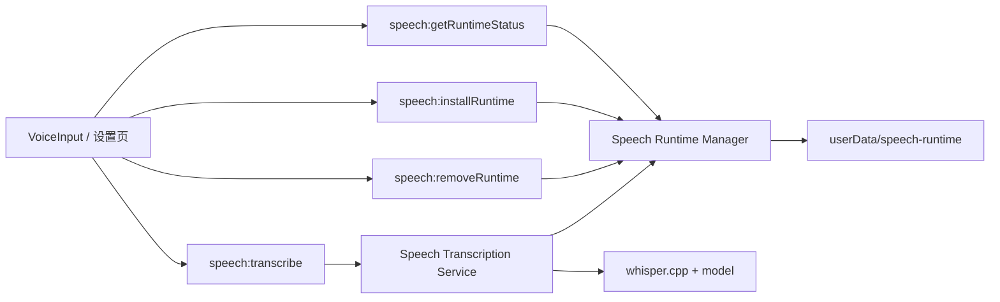

# Chat 语音运行时按需下载方案

## 背景

当前聊天语音输入链路已经具备基本录音和主进程转写能力：

- 渲染进程使用浏览器音频采集能力录制音频
- `useVoiceSession` 通过 Electron IPC 调用主进程转写
- 主进程 `speech/service.mts` 使用 `whisper.cpp` 执行单段转写

但现有方案依赖外部环境变量提供运行时路径：

- `TIBIS_WHISPER_CPP_PATH`
- `TIBIS_WHISPER_MODEL_PATH`
这对开发环境可接受，但对桌面版终端用户不友好。若要求用户自行下载 `whisper.cpp` 和模型并手动配置环境变量，语音转写无法成为可交付产品能力。

同时，`ffmpeg` 的分发与许可证会增加产品化复杂度。本方案改为由渲染进程直接产出语音识别友好的 `wav` 音频，移除运行时对 `ffmpeg` 的正式依赖，并将语音运行时改造成“首次按需下载 + 设置页管理”的产品化能力，同时支持 `macOS` 与 `Windows`。

## 目标

- 用户首次使用语音输入时，应用自动检查语音运行时是否已安装
- 若未安装，应用引导用户下载所需语音组件，而不是要求用户配置环境变量
- 下载内容按当前平台和架构选择，仅下载当前机器所需资源
- 下载成功后，将资源安装到应用数据目录，后续语音转写自动复用
- 在设置页提供语音组件状态查看、预下载、重装和删除入口
- `speech:transcribe` 优先使用应用内已安装运行时，环境变量仅保留为开发兜底能力

## 非目标

- 第一版不支持多模型切换
- 第一版不支持 Linux
- 第一版不支持后台静默自动升级语音运行时
- 第一版不支持自定义模型路径或用户手动选择第三方可执行文件
- 第一版不支持同时管理多个模型版本

## 推荐方案

采用 `2 + 3` 组合方案：

1. 主路径使用“首次按需下载”
   用户第一次点击语音输入时，如本地缺少运行时，则弹出确认并下载。
2. 补充路径使用“设置页管理入口”
   用户可在设置页提前下载、重装或删除语音组件。

不采用“要求终端用户手动配置环境变量”的正式产品路径。环境变量仅保留给开发和调试场景。

## 方案比较

### 方案 A：安装包内置全部语音组件

优点：

- 安装后即可使用
- 离线体验最好

缺点：

- 安装包体积显著增大
- `macOS` 与 `Windows` 需要分别内置不同平台资源
- 模型或二进制升级需要重新发版

### 方案 B：首次按需下载

优点：

- 主安装包更小
- 仅下载当前平台和架构需要的资源
- 后续升级模型或替换二进制更灵活

缺点：

- 首次使用时需要等待下载
- 需要补齐下载、校验、失败恢复逻辑

### 方案 C：仅设置页手动安装

优点：

- 实现相对简单
- 不强制所有用户下载

缺点：

- 需要用户先理解“语音组件未安装”
- 比首次使用时自动引导多一步操作

### 推荐

推荐采用“方案 B + 方案 C”组合：

- 以首次按需下载承接绝大多数用户路径
- 以设置页安装管理提供可见性和可操作性

## 用户流程

### 首次使用语音输入

1. 用户点击聊天输入工具栏中的麦克风按钮
2. 前端调用主进程运行时状态接口
3. 若状态为 `ready`，直接开始录音
4. 若状态为 `missing` 或 `failed`，弹出下载确认
5. 用户确认后，主进程开始下载当前平台语音组件
6. 前端展示下载与安装进度
7. 下载、解压和校验完成后，状态切换为 `ready`
8. 用户重新开始录音或自动恢复当前操作

### 设置页管理

设置页新增“语音组件”管理区域：

- 未安装时显示状态说明与“下载”按钮
- 已安装时显示平台、架构、模型名、安装目录、版本信息
- 提供“重装”和“删除”按钮
- 下载中显示实时进度

### 失败恢复

若下载失败：

- 展示明确失败原因
- 保留“重试下载”入口
- 不污染当前已安装稳定版本

## 总体架构

将语音能力拆分为三层：

1. `Speech Runtime Manager`
   负责检查、安装、删除和解析语音运行时资源
2. `Speech Transcription Service`
   负责单段音频转写，不承担下载管理职责
3. `Renderer UX`
   负责在语音入口和设置页展示状态并触发安装



## 下载内容策略

第一版安装以下资源：

- `whisper.cpp` 可执行文件
- 1 个默认模型文件

默认模型只保留一个，优先保证“可稳定交付”，不在第一版引入模型切换。

## 录音格式策略

第一版录音不再依赖 `MediaRecorder -> webm -> ffmpeg -> wav` 链路，而是改为：

- 渲染进程采集 PCM 数据
- 渲染进程直接编码单声道 `wav`
- 主进程直接将 `wav` 交给 `whisper.cpp`

推荐参数：

- `16000 Hz`
- `mono`
- `16-bit PCM`

该参数组合对语音识别足够友好，同时可以有效控制文件大小。

按该参数估算：

- 每秒约 `32 KB`
- 每 4 秒分段约 `128 KB`
- 每分钟约 `1.9 MB`

因此第一版继续保留短分段策略，不拼接超长原始录音：

- 默认每 `3-5` 秒生成一个 `wav` 段
- 每段单独转写
- 段转写完成后即可释放对应内存

这样可以同时解决：

- `ffmpeg` 许可证与分发复杂度
- 长录音导致的单次内存压力
- 超大 IPC 载荷风险

### 平台范围

第一版支持以下平台组合：

- `darwin-arm64`
- `darwin-x64`
- `win32-x64`

第一版暂不支持：

- `linux-*`
- `win32-arm64`

## 安装目录与路径策略

正式产品路径统一安装到：

- `app.getPath('userData')/speech-runtime`

目录建议结构：

```text
speech-runtime/
  manifest.json
  current/
    bin/
      whisper
    models/
      default-model.bin
```

其中：

- `manifest.json` 记录当前已安装版本、平台、模型和校验信息
- `current/` 指向当前稳定可用运行时

环境变量继续保留，但只作为开发兜底：

1. 正式运行先检查应用安装目录
2. 若不存在，再回退到环境变量路径

## 主进程模块划分

建议扩展现有 `electron/main/modules/speech` 目录结构：

- `types.mts`
  - 扩展运行时状态、安装进度、资源清单类型
- `runtime.mts`
  - 负责安装目录解析、状态检查、已安装运行时路径解析、删除
- `installer.mts`
  - 负责下载、解压、校验、原子替换
- `service.mts`
  - 保持转写职责，通过 `runtime.mts` 解析运行时路径
- `ipc.mts`
  - 新增运行时相关 IPC handlers

## 类型设计

### 运行时状态

```ts
type SpeechRuntimeState = 'ready' | 'missing' | 'installing' | 'failed';

interface SpeechRuntimeStatus {
  state: SpeechRuntimeState;
  platform: 'darwin' | 'win32';
  arch: 'arm64' | 'x64';
  modelName?: string;
  installDir?: string;
  version?: string;
  errorMessage?: string;
}
```

### 安装进度

```ts
type SpeechInstallPhase = 'downloading' | 'extracting' | 'verifying' | 'completed';

interface SpeechInstallProgress {
  phase: SpeechInstallPhase;
  current: number;
  total: number;
  message: string;
}
```

### 资源清单

```ts
interface SpeechRuntimeAsset {
  name: 'whisper' | 'model';
  url: string;
  sha256: string;
  archiveType: 'file' | 'zip';
  targetRelativePath: string;
}

interface SpeechRuntimeManifestDefinition {
  platform: 'darwin' | 'win32';
  arch: 'arm64' | 'x64';
  version: string;
  modelName: string;
  assets: SpeechRuntimeAsset[];
}
```

## IPC 设计

新增以下主进程接口：

- `speech:getRuntimeStatus`
  - 返回当前安装状态与元信息
- `speech:installRuntime`
  - 启动下载与安装流程
- `speech:removeRuntime`
  - 删除已安装运行时
- `speech:transcribe`
  - 保留现有接口，内部改成优先使用安装运行时

进度同步可采用两种方式之一：

1. `installRuntime` 返回后通过事件推送进度
2. `installRuntime` 本身返回可轮询的任务 ID

第一版推荐事件推送，减少前端轮询复杂度。

## 前端集成

### 语音输入入口

[src/components/BChatSidebar/components/InputToolbar/VoiceInput.vue](src/components/BChatSidebar/components/InputToolbar/VoiceInput.vue) 在开始录音前增加运行时检查：

1. 调用 `getRuntimeStatus`
2. 若 `ready`，继续原有录音流程
3. 若缺失，弹出安装确认对话框
4. 安装完成后重新允许录音

### 设置页

在设置页新增“语音组件”卡片，职责包括：

- 展示状态
- 支持预下载
- 支持重装
- 支持删除
- 展示下载中进度

该卡片不提供模型切换或高级路径配置，避免第一版配置复杂化。

## 转写服务调整

现有 [electron/main/modules/speech/service.mts](electron/main/modules/speech/service.mts) 需要调整为：

- 优先通过 `runtime.mts` 获取 `whisper` 和模型路径
- 若运行时目录不存在，则尝试环境变量兜底
- 若两者都不存在，返回明确错误信息

这样可以兼顾：

- 正式用户走应用内安装路径
- 开发人员走本地环境变量

## 安装实现细节

### 原子安装

安装必须使用临时目录，避免下载中断污染稳定版本：

1. 下载到 `speech-runtime/tmp/<task-id>/`
2. 解压与校验完成
3. 生成新的 `manifest.json`
4. 用原子替换方式切换到 `speech-runtime/current/`
5. 清理临时目录

### 校验

每个下载资源必须校验：

- 文件存在性
- `sha256`
- 可执行文件权限
- 模型文件可读性

### 删除

删除运行时时：

- 只删除 `userData/speech-runtime` 下的应用自管目录
- 不删除开发环境变量指向的外部路径

## 错误处理

错误需要分层表达：

- 网络错误：下载失败、超时、DNS 失败
- 资源错误：压缩包损坏、校验失败、缺少可执行文件
- 平台错误：当前平台或架构不支持
- 运行时错误：安装完成但启动 `whisper.cpp` 失败

前端展示原则：

- 让用户知道“缺什么”和“接下来可以做什么”
- 不直接暴露底层堆栈，设置页可额外提供调试详情

## 测试策略

### 单元测试

- `runtime.mts`
  - 状态检测
  - 安装目录解析
  - 环境变量回退逻辑
- `installer.mts`
  - 资源清单解析
  - 校验失败处理
  - 原子替换流程
- `service.mts`
  - 优先使用安装路径
  - 缺失时回退环境变量

### 组件测试

- 语音按钮在 `ready` / `missing` / `installing` 状态下的交互
- 设置页语音组件卡片状态展示和按钮行为

### 集成验证

- `macOS arm64`
- `macOS x64`
- `Windows x64`

至少验证：

- 首次点击麦克风触发安装
- 安装成功后可实际转写
- 删除后重新触发安装
- 安装失败后可重试

## 风险与约束

- 模型文件体积可能导致首次安装时间较长
- `Windows` 可执行文件和解压细节需单独验证
- `whisper.cpp` 及模型文件的分发方式和许可证需在实施前确认
- 若未来引入多模型，当前 `current/` 单运行时结构需要扩展

## 最小实现范围

第一版必须完成：

- 首次使用语音时按需下载运行时
- 设置页语音组件管理入口
- 已安装运行时优先转写
- 安装成功后能直接完成语音转文字
- 转写结果回写输入框

第一版明确不做：

- 模型切换
- 自动后台升级
- Linux 支持
- 用户自定义外部路径

## 结论

该方案将语音运行时从“开发者手动配置依赖”提升为“终端用户可理解、可安装、可管理”的桌面产品能力。通过“首次按需下载 + 设置页管理入口”的组合，可以在控制安装包体积的同时，提供足够顺滑的首次使用体验，并为后续模型升级和多平台扩展保留空间。
