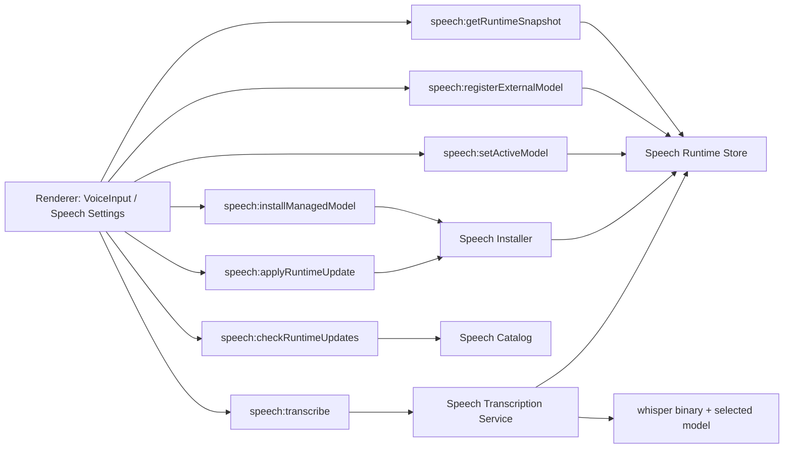

# Chat 语音运行时 V2 设计

## 背景

`docs/superpowers/specs/2026-05-04-speech-runtime-on-demand-design.md` 定义的第一版语音运行时按需下载方案已经落地，当前仓库中已经具备以下能力：

- 渲染进程直接录制 `wav` 并分段上传
- 主进程通过 `speech` 模块调用 `whisper.cpp` 完成单段转写
- 首次使用麦克风时自动检测并安装语音运行时
- 设置页提供语音组件的查看、下载、重装和删除入口
- 运行时默认安装到 `app.getPath('userData')/speech-runtime`

当前实现的核心限制是“单运行时 + 单模型”：

- `resources/speech/manifest.json` 每个平台只描述一个 `modelName`
- 本地 `speech-runtime/manifest.json` 只记录一个当前版本和一个当前模型
- `runtime.mts` 只能解析一份已安装模型路径
- 设置页只能表达“已安装 / 未安装”的单状态，不支持多模型并存和切换

这使得以下第二阶段需求无法自然演进：

1. 官方模型并存下载和切换
2. 用户导入第三方模型文件并在多个来源之间切换
3. 后台检查和下载更新，同时保留当前稳定版本并支持回滚

## 目标

1. 支持多个官方模型并存安装、删除和切换
2. 支持用户注册多个第三方模型文件路径，并由用户显式选择生效项
3. 支持后台检查运行时和官方模型更新
4. 支持后台下载更新，并在用户确认后切换生效版本
5. 支持从第一版单模型结构平滑迁移到第二版结构
6. 保持 `speech/service.mts` 的职责聚焦在“执行转写”，不把安装和选择逻辑耦合进去

## 非目标

1. 第二版不支持用户自定义第三方 `whisper` 可执行文件路径
2. 第二版不支持 Linux 平台
3. 第二版不做完全静默的自动切换更新
4. 第二版不支持同时选择多个模型做级联或投票转写
5. 第二版不引入云端语音服务回退路径

## 用户决策与产品原则

### 原则 1：模型来源并存，但生效项必须显式选择

第二版允许以下资源同时存在：

- 应用托管的官方模型
- 用户注册的第三方本地模型

当二者并存时，不设置隐式优先级。实际生效模型始终由用户在设置页中明确选择。

### 原则 2：后台更新可自动下载，但不自动切换

后台更新的默认目标是“降低等待成本”，不是“绕过用户控制”。

因此第二版允许：

- 后台检查更新
- 后台下载更新

但不允许：

- 下载完成后直接替换当前生效版本
- 在用户无感知的情况下切换当前模型或 binary

更新切换必须由用户在设置页或轻提示中确认。

### 原则 3：稳定优先于彻底自动化

语音转写直接依赖本地二进制和模型文件，任何“正在使用中的资源被替换”的行为都可能引入不透明故障。第二版优先保证：

- 当前稳定版本不被失败下载污染
- 切换失败后可以回滚
- 已注册外部模型失效时有明确提示

## 方案比较

### 方案 A：继续沿用单 `current/` 结构，切换模型时整体重装

优点：

- 对现有代码改动最小
- `speech/service.mts` 几乎不用改

缺点：

- 无法真正支持多模型并存
- 模型切换成本高，且容易覆盖当前稳定状态
- 外部模型路径难以融入
- 后台升级和回滚边界模糊

### 方案 B：拆成“共享 binary + 多模型仓库 + 当前选择”

优点：

- 官方模型可以并存
- 外部模型路径可以作为同一选择体系的一部分
- 后台更新与回滚有明确边界
- 与“用户显式选择生效项”的产品决策一致

缺点：

- 需要重构本地状态、manifest 结构和设置页
- 需要新增迁移逻辑

### 方案 C：将 binary + model 组合成多个 profile

优点：

- 概念上最灵活
- 每套 profile 天然隔离

缺点：

- 对“只是切模型”的场景过重
- 用户理解成本高
- binary 常常没必要与 model 绑定成完整 profile

## 推荐方案

推荐采用方案 B：

- 将 `whisper` binary 视为平台运行时资源
- 将官方模型视为可并存的托管资源
- 将第三方模型视为注册到系统中的外部资源
- 将当前“生效项”抽象成独立的 `selection`

该方案最适合同时承接：

1. 多模型切换
2. 第三方模型路径注册
3. 后台更新下载与受控切换

## 总体架构

第二版将语音能力拆成五层：

1. `Speech Catalog`
   - 拉取远端 binary 和模型目录清单
2. `Speech Runtime Store`
   - 管理本地状态、已安装资源和当前选择
3. `Speech Installer`
   - 下载、校验、staging、提交安装
4. `Speech Transcription Service`
   - 解析当前选择并执行转写
5. `Renderer UX`
   - 设置页管理、聊天入口兜底和更新提示



## 目录结构设计

第二版将 `app.getPath('userData')/speech-runtime` 重构为仓库结构：

```text
speech-runtime/
  state.json
  binaries/
    darwin-arm64/
      2026.05.04/
        whisper
  managed-models/
    ggml-base/
      1/
        model.bin
        meta.json
    ggml-small/
      1/
        model.bin
        meta.json
  cache/
    downloads/
  temp/
```

目录职责如下：

- `state.json`
  - 记录已安装 binary、已安装官方模型、已注册外部模型、当前选择、更新策略和待应用更新信息
- `binaries/`
  - 按平台和版本保存官方分发的 `whisper` binary
- `managed-models/`
  - 按模型 ID 和模型版本保存官方模型
- `cache/downloads/`
  - 保存下载中的临时文件或已完成但未提交的缓存
- `temp/`
  - 保存一次性安装和解压中间目录

第二版不再使用第一版的：

- `speech-runtime/current/`
- `speech-runtime/manifest.json`

## 核心状态模型

### 本地状态文件

建议新增 `speech-runtime/state.json`，结构示意如下：

```json
{
  "schemaVersion": 2,
  "platform": "darwin",
  "arch": "arm64",
  "selectedModel": {
    "sourceType": "managed",
    "modelId": "ggml-base"
  },
  "binaries": {
    "currentVersion": "2026.05.04",
    "installed": [
      {
        "version": "2026.05.04",
        "relativePath": "binaries/darwin-arm64/2026.05.04/whisper",
        "sha256": "..."
      }
    ]
  },
  "managedModels": [
    {
      "id": "ggml-base",
      "displayName": "Base",
      "version": "1",
      "relativePath": "managed-models/ggml-base/1/model.bin",
      "sha256": "...",
      "sizeBytes": 147000000
    }
  ],
  "externalModels": [
    {
      "id": "external-1",
      "displayName": "Meeting Model",
      "filePath": "/Users/example/models/meeting.bin",
      "lastValidatedAt": 1746460800000,
      "lastValidationState": "ready"
    }
  ],
  "updates": {
    "autoCheck": true,
    "autoDownload": false,
    "binaryUpdate": null,
    "modelUpdates": []
  }
}
```

### 核心类型

建议在 `electron/main/modules/speech/types.mts` 中新增或替换为以下概念：

```ts
/**
 * 当前模型选择。
 */
export interface SpeechModelSelection {
  /** 模型来源类型。 */
  sourceType: 'managed' | 'external';
  /** 模型唯一标识。 */
  modelId: string;
}

/**
 * 已安装 binary 记录。
 */
export interface SpeechBinaryRecord {
  /** binary 版本。 */
  version: string;
  /** binary 相对运行时根目录的路径。 */
  relativePath: string;
  /** binary sha256。 */
  sha256: string;
}

/**
 * 应用托管模型记录。
 */
export interface SpeechManagedModelRecord {
  /** 模型唯一标识。 */
  id: string;
  /** 设置页展示名称。 */
  displayName: string;
  /** 模型版本。 */
  version: string;
  /** 模型文件相对运行时根目录的路径。 */
  relativePath: string;
  /** 模型 sha256。 */
  sha256: string;
  /** 模型字节大小。 */
  sizeBytes: number;
}

/**
 * 外部模型记录。
 */
export interface SpeechExternalModelRecord {
  /** 模型唯一标识。 */
  id: string;
  /** 用户可编辑展示名。 */
  displayName: string;
  /** 模型绝对路径。 */
  filePath: string;
  /** 最近一次校验时间。 */
  lastValidatedAt?: number;
  /** 最近一次校验状态。 */
  lastValidationState: 'ready' | 'missing' | 'invalid';
  /** 最近一次校验错误。 */
  lastErrorMessage?: string;
}
```

### 运行时快照

设置页和聊天入口需要的不再是第一版单一 `SpeechRuntimeStatus`，而是一个聚合快照：

```ts
/**
 * 语音运行时快照。
 */
export interface SpeechRuntimeSnapshot {
  /** 当前平台。 */
  platform: 'darwin' | 'win32';
  /** 当前架构。 */
  arch: 'arm64' | 'x64';
  /** binary 是否可用。 */
  binaryState: 'ready' | 'missing' | 'failed';
  /** 当前 binary 版本。 */
  binaryVersion?: string;
  /** 当前选中的模型。 */
  selectedModel?: SpeechModelSelection;
  /** 已安装官方模型。 */
  managedModels: SpeechManagedModelRecord[];
  /** 已注册外部模型。 */
  externalModels: SpeechExternalModelRecord[];
  /** 是否存在任一可用模型。 */
  hasUsableModel: boolean;
  /** 当前选择解析后的最终状态。 */
  activeState: 'ready' | 'missing-model' | 'invalid-selection' | 'failed';
  /** 可选错误信息。 */
  errorMessage?: string;
}
```

## 远端 Manifest V2 设计

第一版 `resources/speech/manifest.json` 的问题是“每个平台只绑定一个模型”。第二版需要将 binary 和模型目录解耦。

建议将远端 manifest 升级为：

```json
{
  "schemaVersion": 2,
  "binaries": {
    "darwin-arm64": {
      "currentVersion": "2026.05.04",
      "versions": [
        {
          "version": "2026.05.04",
          "url": "https://example.com/whisper-darwin-arm64",
          "sha256": "...",
          "archiveType": "file"
        }
      ]
    }
  },
  "models": [
    {
      "id": "ggml-base",
      "displayName": "Base",
      "version": "1",
      "url": "https://example.com/ggml-base.bin",
      "sha256": "...",
      "sizeBytes": 147000000,
      "recommendedFor": "通用快速转写"
    },
    {
      "id": "ggml-small",
      "displayName": "Small",
      "version": "1",
      "url": "https://example.com/ggml-small.bin",
      "sha256": "...",
      "sizeBytes": 488000000,
      "recommendedFor": "更高精度"
    }
  ]
}
```

设计原则如下：

1. `binaries` 按平台区分，仅声明当前平台可用 binary 版本
2. `models` 为平台无关目录，只描述官方模型资源
3. 一个模型由稳定 `id` 和可变 `version` 共同标识
4. `displayName`、`recommendedFor`、`sizeBytes` 直接服务设置页展示

## 安装与更新协议

### 官方 binary

binary 安装流程：

1. 拉取 manifest
2. 选择当前 `platform-arch` 的目标 binary 版本
3. 下载到 `cache/downloads/`
4. 校验 `sha256`
5. 写入 `binaries/<platform-arch>/<version>/`
6. 更新 `state.json` 中的 binary 记录
7. 如用户确认切换，将 `currentVersion` 指向新版本

### 官方模型

官方模型安装流程：

1. 拉取 manifest
2. 根据用户点击的 `modelId` 找到资源
3. 下载到 `cache/downloads/`
4. 校验 `sha256`
5. 写入 `managed-models/<modelId>/<version>/model.bin`
6. 写入同目录 `meta.json`
7. 更新 `state.json.managedModels`
8. 若用户选择“安装并设为当前”，再更新 `selectedModel`

### 外部模型

外部模型注册流程：

1. 用户在设置页选择本地 `.bin` 文件
2. 主进程校验路径存在、可读且扩展名或文件头满足基本规则
3. 生成稳定 `id`
4. 写入 `state.json.externalModels`
5. 若用户选择“设为当前”，更新 `selectedModel`

第二版不复制外部模型文件，只保存引用。

### 删除

删除策略：

- 删除官方模型时，若该模型正被选中，则先要求用户改选其他模型
- 删除外部模型时，若该模型正被选中，同样先要求改选
- 删除 binary 时，仅允许删除当前未生效且无待回滚依赖的旧版本

## 当前选择解析策略

`speech/service.mts` 在执行转写前，需要通过 `runtime.mts` 完成以下解析：

1. 读取 `state.json`
2. 找到当前 binary 版本并解析实际可执行文件路径
3. 读取 `selectedModel`
4. 若为 `managed`：
   - 在 `managedModels` 中找到对应记录
   - 解析实际模型路径
5. 若为 `external`：
   - 在 `externalModels` 中找到对应记录
   - 直接使用其绝对路径
6. 校验 binary 和模型文件均存在
7. 返回 `SpeechRuntimeConfig`

如果当前选择无效：

- 设置页展示明确错误
- 聊天页麦克风入口阻止录音
- 提示用户去设置页下载官方模型或重新选择外部模型

## 设置页交互设计

第二版设置页保留在 `src/views/settings/speech/index.vue`，但从“单状态页”升级为“运行时与模型管理页”。

建议拆成四个区块。

### 1. 运行时概览

展示：

- 平台
- 架构
- 当前 binary 版本
- 自动检查更新状态
- 自动下载更新状态

操作：

- 检查更新
- 下载更新
- 应用更新
- 回滚上一个 binary 版本

### 2. 官方模型

列表展示每个可用官方模型：

- 名称
- 当前版本
- 大小
- 推荐场景说明
- 状态：未安装 / 已安装 / 可更新 / 当前使用中

操作：

- 下载
- 删除
- 设为当前
- 更新到新版本

### 3. 外部模型

展示已注册外部模型列表：

- 自定义名称
- 文件路径
- 最近校验状态
- 当前是否生效

操作：

- 添加本地模型
- 重命名
- 重新校验
- 设为当前
- 移除

### 4. 当前生效配置

单独展示当前实际生效项，例如：

- `当前使用：官方模型 / Base / v1`
- `当前使用：外部模型 / Meeting Model`

目的不是提供新操作，而是避免用户混淆“我安装了哪些”与“我现在实际在用哪个”。

## 聊天入口兜底策略

`src/components/BChatSidebar/components/InputToolbar/VoiceInput.vue` 在第二版不再只判断“runtime ready / missing”，而是判断：

1. binary 是否可用
2. 当前是否有选中的可用模型

交互策略：

- 若 binary 缺失：
  - 与第一版类似，引导安装基础运行时
- 若 binary 已就绪，但没有任何可用模型：
  - 提示用户去设置页下载官方模型或添加外部模型
- 若当前选中的外部模型失效：
  - 明确提示“当前语音模型文件不可用，请前往设置页重新选择”
- 若一切可用：
  - 正常开始录音和分段转写

## 后台更新策略

第二版支持后台检查和后台下载，但不做静默切换。

### 检查时机

允许以下时机触发检查：

- 应用启动后延迟检查一次
- 用户进入语音设置页时检查一次
- 用户手动点击“检查更新”

### 检查结果

后台检查后可得到：

- binary 有新版本
- 某个已安装官方模型有新版本
- 无更新

结果写入 `state.json.updates`，并同步给设置页。

### 后台下载

若用户启用“自动下载更新”：

- 可以在后台下载 binary 或模型新版本
- 下载后仅写入 staging 安装目录和状态记录
- 不自动切换 `currentVersion`
- 不自动改写 `selectedModel`

### 应用更新

更新应用时：

1. 用户在设置页点击“应用更新”
2. 主进程确认新资源已完整下载并通过校验
3. 更新 `state.json` 中的当前 binary 版本或当前模型版本记录
4. 保留旧版本资源，作为回滚候选

### 回滚

回滚目标：

- binary 切换失败后回滚到上一版本
- 官方模型切换失败后回滚到上一版本

回滚方式：

- 不移动大文件
- 仅改写 `state.json` 中的当前指针

这是第二版采用“仓库 + 指针”结构的重要收益。

## 迁移策略

第二版必须兼容第一版已安装用户。

### 迁移触发时机

当应用启动并首次访问语音模块时：

1. 检查是否存在旧 `speech-runtime/manifest.json`
2. 检查是否不存在新 `speech-runtime/state.json`
3. 若满足上述条件，则执行一次性迁移

### 迁移步骤

1. 读取旧 `manifest.json`
2. 解析旧 `current/bin/whisper` 或 `whisper.exe`
3. 解析旧 `current/models/<modelName>.bin`
4. 将旧 binary 记为一条 `SpeechBinaryRecord`
5. 将旧模型记为一条 `SpeechManagedModelRecord`
6. 生成新的 `state.json`
7. 将 `selectedModel` 指向迁移出的官方模型
8. 保留旧目录直到新状态写入成功
9. 新状态可用后，再清理旧 `manifest.json` 和 `current/`

### 失败处理

若迁移中任一步失败：

- 不删除旧结构
- 将第二版状态标记为迁移失败
- 设置页展示“需要重新安装语音组件”的明确说明

## 模块改造建议

建议调整 `electron/main/modules/speech` 目录：

- `types.mts`
  - 新增 V2 运行时、模型、更新和快照类型
- `runtime.mts`
  - 负责 `state.json` 读写、当前选择解析、迁移、模型可用性校验
- `installer.mts`
  - 负责 binary 和官方模型安装、staging、删除和应用更新
- `catalog.mts`
  - 负责远端 manifest V2 拉取和解析
- `service.mts`
  - 基于 `selectedModel` 解析最终配置并执行转写
- `ipc.mts`
  - 对渲染层暴露新查询和新操作接口

## IPC 设计建议

建议保留旧接口语义的同时，新增以下接口：

- `speech:getRuntimeSnapshot`
- `speech:listCatalogModels`
- `speech:installManagedModel`
- `speech:removeManagedModel`
- `speech:listExternalModels`
- `speech:registerExternalModel`
- `speech:renameExternalModel`
- `speech:revalidateExternalModel`
- `speech:removeExternalModel`
- `speech:setActiveModel`
- `speech:checkRuntimeUpdates`
- `speech:downloadRuntimeUpdates`
- `speech:applyRuntimeUpdate`
- `speech:rollbackRuntimeUpdate`

旧接口兼容建议：

- `speech:getRuntimeStatus`
  - 保留一段过渡期，但内部转发到 `getRuntimeSnapshot` 的简化映射
- `speech:installRuntime`
  - 第二版语义改为“确保当前平台 binary 就绪，并在缺省情况下安装推荐默认官方模型”
- `speech:removeRuntime`
  - 第二版需谨慎收窄语义，优先改为“清空所有受管资源”并显式提示风险

## 错误处理

需要重点覆盖以下错误类型：

1. manifest 拉取失败
2. binary 下载失败
3. 模型下载失败
4. 下载校验失败
5. 外部模型路径不存在
6. 外部模型权限不足
7. 当前选择缺失
8. 当前选择指向损坏资源
9. 更新切换后首次转写失败
10. 第一版迁移失败

错误原则：

- 不覆盖当前稳定状态
- 错误消息可直接面向用户展示
- 失败下载不会自动污染 `selectedModel`
- 可恢复操作优先提供“重试”或“重新选择”入口

## 测试策略

第二版重点补以下测试：

### 主进程单元测试

- `runtime.mts`
  - 读取和写入 `state.json`
  - 解析当前生效模型
  - 外部模型失效检测
  - 第一版迁移逻辑

- `installer.mts`
  - 安装 binary
  - 安装官方模型
  - 删除官方模型
  - 应用更新与回滚

- `catalog.mts`
  - 解析 manifest V2
  - 识别 binary 和模型更新

- `service.mts`
  - `managed` 模型路径解析
  - `external` 模型路径解析
  - 无效选择拦截

### 渲染层测试

- 设置页展示官方模型与外部模型列表
- 设置页切换当前模型
- 设置页展示更新可用状态
- 聊天入口在无模型、外部模型失效时的提示逻辑

## 实施边界

为了控制第二版复杂度，建议拆成以下顺序：

1. 重构本地状态模型和解析逻辑
2. 支持多个官方模型并存与切换
3. 支持外部模型注册与切换
4. 支持后台检查更新
5. 支持后台下载、应用更新和回滚

这样可以先把“多模型切换”主目标闭环，再逐步叠加后台更新能力。

## 设计结论

第二版应从“单运行时单模型”升级为“binary 仓库 + 官方模型仓库 + 外部模型注册表 + 当前选择指针”的结构。

具体落地原则如下：

1. 官方模型与外部模型允许并存
2. 当前生效项由用户显式选择，不做隐式优先级
3. 后台更新允许检查和下载，但不做静默切换
4. 回滚通过改写状态指针完成，而不是搬运大文件
5. 第一版用户通过一次性迁移进入第二版结构

该方案能够在不牺牲稳定性的前提下，同时承接：

- 多模型切换
- 第三方模型路径接入
- 后台更新与回滚

并为后续更丰富的模型目录或平台扩展保留演进空间。
