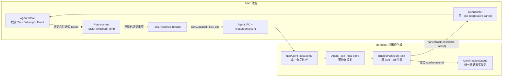

# Child Agent 轻量任务卡片设计

**日期：** 2026-07-28

**状态：** 已确认，待实施计划

**上位设计：** [Primary 委派 Child Agent 设计](2026-07-22-primary-delegated-child-agent-design.md)

## 1. 背景

Primary 委派 Child Agent 的运行、恢复、确认和提交协议已经落在 Main 进程，但普通聊天消息只保存原始 `delegate_task` Tool Part 和终态结果。Renderer 如果只读取消息，会遇到以下问题：

- Child 运行期间没有可恢复的实时状态。
- 通用工具气泡会把 IPC 成功误认为 Task 执行成功。
- BChat 卸载或 Renderer 重载后，临时组件状态丢失。
- 同一 Session 的不同 Assistant 消息也可能出现相同 `toolCallId`，按 Session 或 Tool Call 查询都会串任务。
- Main 内部 Task、Result 和 Event 包含不能进入 Renderer 的模型、权限、路径和私有引用。
- 现有取消入口面向整个 Checkpoint，不能安全取消单个 Child。

本设计细化上位设计的“阶段 E：UI、取消与 Renderer 恢复”，建立 Main-owned Task 公开投影、应用级 Renderer Store 和固定在原 Tool Part 位置的轻量任务卡片。

## 2. 目标

首个完整版本需要：

1. 在原 `delegate_task` Tool Part 位置持续展示 Child Task。
2. 支持运行状态、Attempt、已裁剪时间线、验收结果、成本、错误和写入摘要。
3. Renderer 重载后从 Main 快照恢复，并能处理事件先到、重复、乱序和 Pump 合并造成的合法 sequence 跳号。
4. 复用统一 ConfirmationQueue，允许从 Task 卡片定位对应确认。
5. 提供只影响一个 Task 的 cooperative cancellation。
6. 只向 Renderer 暴露显式 allowlist 字段。
7. 保持 Main 为唯一事实源，BChat 和 Pinia Store 都只是可替换投影。

## 3. 非目标

本阶段不实现：

- 与 Child 直接聊天。
- 在卡片中修改 Contract。
- 切换 Child 模型。
- 用户手动重试；自动 stale changeset 重试仍由既有协议决定。
- artifact 从 `primary` 提升为 `user` 的工作流。
- 展示完整 Child transcript、Prompt、原始推理或完整工具输出。
- 开启生产环境受控写入功能开关。
- 改变“一层 Child、Child 不能继续委派”的约束。

## 4. 核心不变式

1. **Task 是身份，Attempt 是执行，Event 是历史，Runtime 是可替换实例。**
2. `chat_agent_tasks`、Attempt、Result 和 Event 是权威事实；Renderer 投影不能反向修改这些事实。
3. Task 的公开 `taskSequence` 等于该 Task 聚合最新已提交 Event 的 sequence，只能单调增加，但 Application Event 之间不要求连续。
4. 事务未提交时不能发布 `task.updated`；事务回滚不能被 Renderer 观察到。
5. Renderer 只接受比本地 cursor 新的投影，旧事件不能覆盖或复活终态、tombstone。
6. 恢复只能重放已持久化事实，不能根据当前可用能力猜测升级。
7. 卡片匹配键是 `sessionId + assistantMessageId + toolCallId`；数据库唯一性仍以 `checkpointId + toolCallId` 为准。
8. 默认查询不返回 tombstone；显式 Task 查询只能返回最小 tombstone 标记。
9. 单 Task 取消不能调用 Checkpoint 取消，也不能影响 sibling Task。
10. `committing` 的不可逆边界优先于迟到取消，UI 不能虚报“已取消”。
11. artifact 只有 `visibility=user` 时才能进入投影并被卡片打开。
12. 缺少可靠货币成本时必须显示 `unknown`，不能用零代替。

为使 Renderer 匹配键和持久化唯一性等价，`assistantMessageId` 必须是 Checkpoint 的不可变唯一身份。数据库增加 `UNIQUE(assistant_message_id)`；Projector 通过 Task 的 `checkpointId` 读取该值。结合已有 `UNIQUE(checkpoint_id, tool_call_id)`，同一 Assistant 消息内的 Tool Part 可以稳定定位且不会跨 Turn 碰撞。

创建唯一索引前先只读审计既有记录；发现重复时不得删除、合并或猜测归属，而是以稳定 migration/protocol error 关闭 Task 卡片投影，等待人工处理。

## 5. 总体架构



Main 负责事实、投影、裁剪和命令校验。Renderer 应用级 Store 负责收敛快照与事件。卡片只读 Store，并把确认定位和取消请求发送到既有应用服务。

## 6. Main 公开 Task 投影

### 6.1 投影类型

共享类型放在 `types/chat-agent.d.ts`。以下结构是公开协议，不复用内部 `AgentTaskRecord` 或完整 `ChatAgentEvent`：

```ts
/** Renderer 可安全展示的资源引用。 */
export interface ChatAgentTaskResourceSnapshot {
  /** 资源类型。 */
  readonly kind: AgentResourceReference['kind'];
  /** 仓库相对路径或稳定资源域标识。 */
  readonly displayReference: string;
  /** 调用方观察到的可选修订。 */
  readonly revision?: string;
}

/** 当前 Attempt 与可替换 Runtime 的展示状态。 */
export interface ChatAgentTaskAttemptSnapshot {
  /** Attempt 稳定身份。 */
  readonly attemptId: string;
  /** 从一开始的 Attempt 序号。 */
  readonly attemptNumber: number;
  /** Child Actor 稳定身份。 */
  readonly agentId: string;
  /** Attempt 自身的持久化执行状态。 */
  readonly attemptState: 'starting' | 'running' | 'completed' | 'failed' | 'cancelled' | 'deadline_exceeded' | 'interrupted';
  /** 当前可替换 Runtime 身份。 */
  readonly runtimeId: string;
  /** Attempt 创建时间。 */
  readonly createdAt: string;
  /** Runtime 开始时间。 */
  readonly startedAt?: string;
  /** Attempt 结束时间。 */
  readonly endedAt?: string;
}

/** 经过 allowlist 转换的单条 Task 时间线。 */
export interface ChatAgentTaskTimelineEntry {
  /** Task 聚合内单调 Event sequence。 */
  readonly sequence: number;
  /** 可展示事件类别，不透传内部 Event payload。 */
  readonly type: 'status' | 'runtime' | 'tool' | 'confirmation' | 'commit' | 'warning';
  /** 稳定机器标签，由 Main 映射表生成。 */
  readonly code: string;
  /** 可选用户可读短说明。 */
  readonly summary?: string;
  /** 事件发生时间。 */
  readonly occurredAt: string;
}

/** 被截断的最近 Task 时间线窗口。 */
export interface ChatAgentTaskTimelineSnapshot {
  /** 最多最近五十条已裁剪事件。 */
  readonly entries: readonly ChatAgentTaskTimelineEntry[];
  /** entries 第一条的 sequence；空数组时省略。 */
  readonly firstSequence?: number;
  /** entries 最后一条的 sequence；空数组时省略。 */
  readonly lastSequence?: number;
  /** 更早事件是否被截断。 */
  readonly truncated: boolean;
}

/** 用户可见的单条验收结果。 */
export interface ChatAgentTaskCriterionSnapshot {
  /** 对应 Contract acceptanceCriteria 的稳定索引。 */
  readonly criterionIndex: number;
  /** Child 声明状态。 */
  readonly claimStatus: AgentCriteriaResult['claim']['status'];
  /** 独立验证状态。 */
  readonly verificationStatus: AgentCriteriaResult['verification']['status'];
  /** 来自 Child claim、但已经 Main 裁剪的摘要。 */
  readonly claimSummary: string;
}

/** 任务完成程度与摘要；和执行状态分开表达。 */
export interface ChatAgentTaskCompletionSnapshot {
  /** full、partial 或 none 的完成程度。 */
  readonly level: 'full' | 'partial' | 'none';
  /** 面向用户的紧凑摘要。 */
  readonly summary: string;
  /** 按 Contract 顺序排列的验收结果。 */
  readonly criteria: readonly ChatAgentTaskCriterionSnapshot[];
}

/** Renderer 可安全展示的深只读货币成本。 */
export interface ChatAgentMonetaryCostSnapshot {
  /** ISO-4217 货币代码；不可用时为 unknown。 */
  readonly currency: string | 'unknown';
  /** 定价版本；不可用时为 unknown。 */
  readonly pricingVersion: string | 'unknown';
  /** 估算成本；不可用时为 unknown。 */
  readonly estimated: number | 'unknown';
  /** Provider 实际成本；不可用时为 unknown。 */
  readonly actual: number | 'unknown';
}

/** Renderer 可展示的成本核算。 */
export interface ChatAgentTaskUsageSnapshot {
  /** Provider 输入 token。 */
  readonly inputTokens: number;
  /** Provider 输出 token。 */
  readonly outputTokens: number;
  /** 输入和输出 token 合计。 */
  readonly totalTokens: number;
  /** Provider 模型调用次数。 */
  readonly modelCalls: number;
  /** Agent 工具轮次。 */
  readonly toolRounds: number;
  /** 排队耗时。 */
  readonly queueDurationMs: number;
  /** 执行耗时。 */
  readonly executionDurationMs: number;
  /** 外部请求次数。 */
  readonly externalRequests: number;
  /** 没有可靠价格时保留 unknown。 */
  readonly monetaryCost: ChatAgentMonetaryCostSnapshot;
}

/** Task 卡片允许展示的错误 details 键。 */
export type ChatAgentTaskErrorDetailKey =
  | 'reason'
  | 'toolName'
  | 'expectedHash'
  | 'actualHash'
  | 'expectedVersion'
  | 'actualVersion'
  | 'status'
  | 'limit'
  | 'observed'
  | 'deadlineAt';

/** 公开的深只读结构化错误。 */
export interface ChatAgentTaskErrorSnapshot {
  /** 稳定机器错误码。 */
  readonly code: AgentTaskErrorCode;
  /** 失败协议阶段。 */
  readonly phase: AgentTaskErrorPhase;
  /** 稳定错误类别。 */
  readonly category: 'policy' | 'resource' | 'runtime' | 'protocol' | 'user' | 'integrity';
  /** 同一不可变 Contract 是否允许重试。 */
  readonly retryable: boolean;
  /** 经二次裁剪的辅助展示文本。 */
  readonly message?: string;
  /** 默认不包含资源引用、scope 或内部身份。 */
  readonly details?: Readonly<Partial<Record<ChatAgentTaskErrorDetailKey, string | number | boolean | null>>>;
}

/** 公开的深只读非终止性警告。 */
export interface ChatAgentTaskWarningSnapshot {
  /** 稳定警告码。 */
  readonly code: string;
  /** 经长度和秘密模式裁剪的展示文本。 */
  readonly message: string;
}

/** 写入 Task 的公开 changeset 摘要。 */
export type ChatAgentTaskChangesetPhase =
  | 'prepared'
  | 'awaiting_confirmation'
  | 'approved'
  | 'commit_queued'
  | 'journal_created'
  | 'mutation_applied'
  | 'finalized'
  | 'discarded'
  | 'recovery_required';

/** 写入 Task 的公开 changeset 摘要。 */
export interface ChatAgentTaskChangesetSnapshot {
  /** changeset 稳定身份。 */
  readonly changesetId: string;
  /** 用户确认和提交共同绑定的基础修订。 */
  readonly baseRevision: string;
  /** 用户确认和提交共同绑定的 diff hash。 */
  readonly diffHash: string;
  /** 规范化操作集合 hash。 */
  readonly operationSetHash: string;
  /** 仅包含工作区相对展示路径。 */
  readonly displayPaths: readonly string[];
  /** 提交协议公开阶段。 */
  readonly phase: ChatAgentTaskChangesetPhase;
}

/** 公开 artifact 的深只读 ownership。 */
export interface ChatAgentArtifactOwnerSnapshot {
  /** 来源 Task。 */
  readonly taskId: string;
  /** 来源 Child Actor。 */
  readonly agentId: string;
  /** 来源 Attempt。 */
  readonly attemptId: string;
}

/** 只允许 visibility=user 的 artifact 进入此类型。 */
export interface ChatAgentTaskArtifactSnapshot {
  /** artifact 稳定身份。 */
  readonly artifactId: string;
  /** artifact 种类。 */
  readonly kind: string;
  /** 用户可打开的稳定引用。 */
  readonly reference: string;
  /** 可选内容 hash。 */
  readonly contentHash?: string;
  /** 来源 ownership，不能由 Renderer 改写。 */
  readonly owner: ChatAgentArtifactOwnerSnapshot;
  /** 公开投影固定为 user。 */
  readonly visibility: 'user';
  /** artifact 创建时间。 */
  readonly createdAt: string;
}

/** 已持久化的 cooperative cancellation 请求摘要。 */
export interface ChatAgentTaskCancellationSnapshot {
  /** 区分单卡片取消和 Checkpoint 级联。 */
  readonly requestKind: 'single_task' | 'checkpoint_cascade';
  /** 取消请求写入 Task 聚合的时间。 */
  readonly requestedAt: string;
}

/** 列表、事件和卡片收起态使用的轻量 Task 摘要。 */
export interface ChatAgentTaskSummarySnapshot {
  /** 判别字段。 */
  readonly recordState: 'active';
  /** Task、Session、Assistant 消息和原 Tool Part 身份。 */
  readonly taskId: string;
  readonly sessionId: string;
  readonly turnId: string;
  readonly checkpointId: string;
  readonly assistantMessageId: string;
  readonly toolCallId: string;
  /** 当前 Child Actor。 */
  readonly agentId: string;
  /** 公开投影 Schema 版本。 */
  readonly projectionSchemaVersion: 1;
  /** Task 聚合最新已提交 Event sequence。 */
  readonly taskSequence: number;
  /** 收起态使用的 Contract 字段。 */
  readonly task: string;
  readonly mode: AgentTaskMode;
  readonly required: boolean;
  readonly priority: AgentTaskPriority;
  readonly deadlineAt?: string;
  /** 当前执行状态。 */
  readonly status: AgentTaskStatus;
  readonly queuePhase?: AgentTaskQueuePhase;
  readonly currentAttempt?: ChatAgentTaskAttemptSnapshot;
  /** 已记录的取消请求；没有请求时省略。 */
  readonly cancellation?: ChatAgentTaskCancellationSnapshot;
  /** 经 Main 生成或裁剪的一句进度/终态摘要。 */
  readonly summary?: string;
  /** 投影时间。 */
  readonly createdAt: string;
  readonly updatedAt: string;
}

/** 展开卡片通过定向查询取得的完整公开投影。 */
export interface ChatAgentTaskDetailSnapshot extends ChatAgentTaskSummarySnapshot {
  /** Contract 的用户可见详情。 */
  readonly acceptanceCriteria: readonly string[];
  readonly resources: readonly ChatAgentTaskResourceSnapshot[];
  /** 最近五十条连续已裁剪 Task Event。 */
  readonly timeline: ChatAgentTaskTimelineSnapshot;
  /** 可选终态或进度信息。 */
  readonly completion?: ChatAgentTaskCompletionSnapshot;
  readonly warnings: readonly ChatAgentTaskWarningSnapshot[];
  readonly error?: ChatAgentTaskErrorSnapshot;
  readonly usage?: ChatAgentTaskUsageSnapshot;
  readonly changeset?: ChatAgentTaskChangesetSnapshot;
  readonly artifacts: readonly ChatAgentTaskArtifactSnapshot[];
}

/** 显式查询 tombstone 时返回的最小标记。 */
export interface ChatAgentTaskTombstoneSnapshot {
  /** 判别字段。 */
  readonly recordState: 'tombstoned';
  /** 只保留定位原卡片所需身份。 */
  readonly taskId: string;
  readonly sessionId: string;
  readonly turnId: string;
  readonly checkpointId: string;
  readonly assistantMessageId: string;
  readonly toolCallId: string;
  /** 公开投影 Schema 版本。 */
  readonly projectionSchemaVersion: 1;
  /** tombstone Event sequence。 */
  readonly taskSequence: number;
  /** 记录移除时间。 */
  readonly updatedAt: string;
}

/** 列表分页返回的非 tombstone 摘要。 */
export type ChatAgentTaskListSnapshot = ChatAgentTaskSummarySnapshot;

/** Application Event 可携带的轻量更新。 */
export type ChatAgentTaskEventSnapshot = ChatAgentTaskSummarySnapshot | ChatAgentTaskTombstoneSnapshot;

/** 定向查询可返回的详情或 tombstone。 */
export type ChatAgentTaskSnapshot = ChatAgentTaskDetailSnapshot | ChatAgentTaskTombstoneSnapshot;
```

实际声明中每个字段都保留 JSDoc。上述 `task`、验收标准、资源和摘要仍需经过长度限制与控制字符校验；类型安全不能替代内容裁剪。

`claimSummary` 明确标记为 Child 声明，不能作为系统验证结论。卡片以 `verificationStatus` 为主要结果；`contradicted` 必须覆盖 claim 的 satisfied 视觉语义并形成 warning。

公开文本限制冻结为：Task 和单条 acceptance criterion 最多 4000 字符；资源/artifact 展示引用最多 1024 字符；progress、claim、warning、error message/details 最多 1000 字符；timeline summary 最多 500 字符。集合上限为 criteria 16、resources 32、warnings 16、artifacts 32、changeset paths 32、timeline entries 50；超过公开上限时设置稳定 truncation warning，不能静默冒充完整列表。所有文本先移除控制字符、再执行秘密模式裁剪。单个 Summary/Detail 和单页列表序列化后都不得超过 `AGENT_CANONICAL_PAYLOAD_MAX_BYTES`；列表在达到字节上限时可少于请求 limit，并返回 `nextCursor`。

### 6.2 查询与命令协议

新增三个窄 IPC：

```ts
/** 按 Session 恢复 Task 投影。 */
export interface ChatAgentListTasksInput {
  /** 当前聊天 Session。 */
  readonly sessionId: string;
  /** Main 生成的可选历史分页游标。 */
  readonly cursor?: string;
  /** 请求页大小，默认五十、最大一百。 */
  readonly limit?: number;
}

/** 定向恢复单个 Task，包括 tombstone。 */
export interface ChatAgentGetTaskInput {
  /** Task 所属 Session，用于防止跨 Session 枚举。 */
  readonly sessionId: string;
  /** 目标 Task。 */
  readonly taskId: string;
}

/** 请求协作取消单个 Task。 */
export interface ChatAgentCancelTaskInput {
  /** Task 所属 Session。 */
  readonly sessionId: string;
  /** 目标 Task。 */
  readonly taskId: string;
}

/** 默认 Session 查询的一页轻量摘要。 */
export interface ChatAgentListTasksResult {
  /** 第一页先包含全部活动 Task，再包含一页最近终态 Task。 */
  readonly tasks: readonly ChatAgentTaskListSnapshot[];
  /** 仍有更早终态 Task 时由 Main 生成。 */
  readonly nextCursor?: string;
}

/** 定向查询允许返回最小 tombstone；不存在或 Session 不匹配时返回 null。 */
export type ChatAgentGetTaskResult = ChatAgentTaskSnapshot | null;

/** 单 Task 取消命令的权威处理结果。 */
export interface ChatAgentCancelTaskResult {
  /** 取消请求已记录、提交正在收敛，或 Task 原本已终态。 */
  readonly disposition: 'cancel_requested' | 'commit_in_progress' | 'already_settled';
  /** 命令处理完成时重新投影的 Task。 */
  readonly task: ChatAgentTaskSummarySnapshot;
}
```

对应入口为：

- `chatAgentListTasks({ sessionId, cursor?, limit? })`
- `chatAgentGetTask({ sessionId, taskId })`
- `chatAgentCancelTask({ sessionId, taskId })`

所有输入沿用 `electron/main/modules/chat/agents/ipc.mts` 的严格普通对象、精确键集合、长度限制和控制字符校验。Main 必须验证 Task 确实属于输入 Session；失败时返回稳定 IPC 错误码，不能泄漏其他 Session 是否存在该 Task。

`listTasks` 返回轻量摘要，不返回时间线、criteria、usage、changeset 或 artifact。第一页先返回该 Session 的全部非终态 Task，再按 `updatedAt DESC, taskId DESC` 返回最近终态 Task；后续页只返回更早终态 Task。`limit` 只限制终态历史部分，默认五十且最大一百；活动部分仍受既有单 Turn 最多六个 Child 和 continuation fence 约束。cursor 由 Main 生成并同时绑定 Session 与排序键。列表缺失不能直接解释为删除，因为事件可能先于较旧的列表响应到达。

`getTask` 返回单个完整详情或 tombstone；它用于卡片展开和已渲染 Tool Part 的定向恢复。不存在和 Session 不匹配统一返回 `null`，避免跨 Session 枚举。Renderer 不需要为了打开一个历史 Session 就把无限 Task 详情和时间线全部载入内存。

`cancelTask` 对 tombstone 使用与不存在相同的稳定错误，不返回 tombstone，也不新增审计事实。

### 6.3 Application Event

继续复用唯一 `chat:agent:event` 频道，在 `ChatAgentApplicationEvent` 增加判别分支：

```ts
/** 已提交 Task 公开投影发生变化。 */
export interface ChatAgentTaskUpdatedEvent {
  /** Event 判别字段。 */
  readonly type: 'task.updated';
  /** Application Event Schema 版本。 */
  readonly schemaVersion: 1;
  /** 轻量摘要或 tombstone，不携带展开详情。 */
  readonly task: ChatAgentTaskEventSnapshot;
  /** 和 task.taskSequence 相同的便捷 cursor。 */
  readonly taskSequence: number;
}
```

事件不新增第二个 Renderer 频道，不传内部 Event payload。`taskSequence !== task.taskSequence` 时 Renderer 将其视为协议错误。Application Event 是当前权威摘要，不是逐条审计 Event，因此相邻 Application Event 的 sequence 可以跳号。

单 Task 取消还需要新增内部审计事件：

```ts
/** Task 收到 cooperative cancellation 请求。 */
type AgentTaskCancelRequestedPayload = {
  /** 区分单卡片取消和 Checkpoint 级联。 */
  requestKind: 'single_task' | 'checkpoint_cascade';
};
```

`task.cancel_requested` 属于 Task 聚合，必须先于最终 `task.cancelled`；它不能复用 Checkpoint 聚合的 `delegation.cancel_requested`。公开时间线只把它映射成稳定 `cancel_requested` code，不透传自由文本 reason。

## 7. 投影与发布算法

### 7.1 Allowlist Projector

`AgentTaskProjector` 每次都从已提交 Store 重建当前投影。列表和 Application Event 构建 `ChatAgentTaskSummarySnapshot`；只有 `getTask` 构建 `ChatAgentTaskDetailSnapshot`：

1. 读取 Task、当前 Attempt、Task Events、Result、Changeset 和 artifact 引用。
2. 使用 Task Event 最新 sequence 生成 `taskSequence`。
3. 把内部 Event 映射为固定公开类别和稳定 `code`，不复制原始 payload。
4. Detail 时间线只保留最近五十条，并设置 `firstSequence`、`lastSequence` 和 `truncated`；Summary 不携带时间线。
5. `file/directory` 资源只投影规范化、无 `..` 的仓库相对路径；`document/webview/resource` 必须由对应 resolver 产生 `safeDisplayReference`，没有 resolver 时省略。任何绝对文件路径或原始不透明引用都拒绝投影。
6. changeset 只投影 `displayPath` 和完整性 hash，不投影 `targetPath`、overlay 或 journal 私有引用。
7. artifact 先按 `visibility === 'user'` 过滤，再要求已注册 artifact resolver 返回安全引用和打开能力；未知 kind 直接省略。
8. Result 只投影 completion、criteria、warning、结构化 error、usage 和用户摘要。error details 再按公开键 allowlist 创建新对象；不安全的 `resourceReference` 必须省略，message、warning 和摘要都执行长度、控制字符和秘密模式裁剪。
9. `cancelRequestedAt` 与最新 `task.cancel_requested.requestKind` 一致时才构建 cancellation Summary；不一致视为持久化协议错误。
10. tombstone 只构建最小判别分支。

Projector 必须显式创建新对象，禁止对象 spread 内部记录后再删除敏感字段。

Attempt 投影只读取持久化事实：`attemptState = AgentAttemptRecord.status`、`runtimeId = currentRuntimeId`、`endedAt = finishedAt`。Renderer 重载时不得从易失 Child Registry 猜测一个更“新”的 Runtime 状态。

Detail 时间线必须覆盖本阶段声明的全部 Task Event 类型。为此 `electron/main/modules/chat/agents/executor.mts` 在工具执行前后调用 Store 的 `recordToolStarted` 和 `recordToolCompleted`；Event 只保存 tool call ID、tool name 和 result hash，不保存参数、结果或输出。Projector 校验时间线 entries sequence 严格连续递增、`lastSequence === taskSequence`，且 `truncated` 当且仅当 `firstSequence > 1`。这些是单个 Detail 快照内部检查，不能用相邻 Application Event 是否连续判断丢事件。

changeset 公开阶段按以下优先级确定，禁止 Renderer 自行组合 Task、Confirmation 和 Journal 状态：

| 内部权威事实 | 公开 phase |
|---|---|
| journal `manual_recovery` | `recovery_required` |
| journal `finalized` | `finalized` |
| journal `applied` | `mutation_applied` |
| journal `created/applying` | `journal_created` |
| journal `cancelled` | `discarded` |
| Task `queued(commit)` 且 changeset `approved` | `commit_queued` |
| changeset `approved` | `approved` |
| changeset `awaiting_confirmation` | `awaiting_confirmation` |
| changeset `rejected/revoked/discarded` | `discarded` |
| 其他已准备 changeset | `prepared` |

该表从上到下匹配，journal 事实优先于较旧 changeset 状态。

`journal.status=applying` 折叠为 `journal_created` 只服务展示，绝不能据此判断提交仍可取消；安全取消必须额外检查真实 journal 状态和 operation progress。

### 7.2 Post-commit Task Projection Pump

Task 状态会被 Coordinator、Runtime、ConfirmationStore 和 FileCommitter 多条路径修改，不能只在 Service 的少数入口手工广播。Store 增加统一的提交后通知边界：

1. 所有修改 Task 聚合的公开 Store 方法通过同一个 `runTaskTransaction` 包装器执行。
2. 事务内部记录受影响的 `taskId`，但不调用 Electron 或 Renderer。
3. 只有最外层事务成功返回后，Store 才把 `taskId` 交给 `AgentTaskProjectionPump` 的 no-throw enqueue。
4. Pump 按 `taskId` 合并同一事件循环内的重复通知。
5. Pump 重读 Store 中已提交的 Task 和最新 Event sequence。
6. 若 sequence 不大于该进程最后发布值，则跳过；否则构建轻量 Summary 或 tombstone 并广播 `task.updated`。
7. 投影或广播失败只记录稳定机器码，并允许后续通知、Session 激活或 Renderer 重载通过查询恢复。

该算法保证：

- 回滚事务没有提交后通知。
- 一个事务产生多个内部 Event 时只发布最终权威投影，时间线仍包含全部已提交 Event。
- Main 在“提交成功、广播前”崩溃时不丢事实；重启后的 `listTasks` 或 `getTask` 会恢复最新 sequence。
- 发布失败不回滚已经完成的业务事务。
- enqueue 同步抛错时由 Store 边界吞掉并记录稳定机器码，已经提交的调用仍返回成功；异步 Pump 失败同样不能改变原 mutation 的结果。

Store 到 Pump 的通知只携带 `taskId`，不能携带事务内对象引用。

## 8. Renderer 应用级 Agent Task Store

### 8.1 生命周期

新增 `src/hooks/useChat/useAgentTaskEvents.ts`，并且只由 `src/hooks/useChat/useActorSystem.ts` 的 `useProvideActorSystem()` 应用根入口注册一次。禁止从 `useActorSystem()` 的组件隔离 fallback 注册。BChat 创建和卸载都不能重复注册或停止全局 Agent Event 监听。

初始化顺序固定为：

1. 订阅 `chatAgentOnEvent`。
2. 标记监听已就绪。
3. BChat 激活某个 Session 时调用 `ensureSession(sessionId)`。
4. `ensureSession` 执行 `chatAgentListTasks({ sessionId, limit: 50 })`。
5. 列表响应和期间收到的事件按 `taskSequence` 收敛。

这样不会出现“先查询、后订阅”导致的事件空窗。

### 8.2 Store 结构

新增 `src/stores/chat/agentTask.ts`，至少保存：

```ts
/** 应用级 Child Task Renderer 投影。 */
interface ChatAgentTaskState {
  /** taskId 到最新权威 Summary 或 tombstone。 */
  tasksById: Record<string, ChatAgentTaskEventSnapshot>;
  /** taskId 到按需加载的展开详情。 */
  detailsById: Record<string, ChatAgentTaskDetailSnapshot>;
  /** sessionId + assistantMessageId + toolCallId 到 taskId。 */
  taskIdsByMessageToolCall: Record<string, string>;
  /** tombstone 或已清理投影仍保留的单调 cursor。 */
  taskCursors: Record<string, number>;
  /** 已完成一次成功快照恢复的 Session。 */
  loadedSessions: Record<string, boolean>;
  /** 最近恢复失败但仍保留可信投影的 Session。 */
  staleSessions: Record<string, boolean>;
  /** Main/Renderer schema 不兼容且不应自动重试的 Session。 */
  incompatibleSessions: Record<string, boolean>;
  /** 该 Session 仍可按需加载的下一历史页。 */
  sessionNextCursors: Record<string, string>;
}
```

复合索引由一个集中函数按每段 UTF-8 长度编码，不能用可碰撞的分隔符拼接，也不能在组件中手写。Store 提供：

- `applySummary(snapshot)`
- `applyDetail(snapshot)`
- `applySessionPage(sessionId, page)`
- `ensureSession(sessionId)`
- `ensureTask(sessionId, taskId)`
- `loadNextPage(sessionId)`
- `findTask(sessionId, assistantMessageId, toolCallId)`
- `markSessionStale(sessionId)`

### 8.3 收敛规则

`applySummary` 遵守以下顺序：

1. 校验 projection schema 和身份字段。
2. 找到 `taskCursors[taskId]`。
3. 新 Task 没有 cursor 时，接受完整权威快照，不要求 sequence 从一开始。
4. 相同或更小 sequence 直接忽略。
5. sequence 跳号是 Pump 合并后的正常现象；只比较大小，不触发 resync。
6. 对已有 Task 比较 `sessionId/turnId/checkpointId/assistantMessageId/toolCallId` 公共不可变身份，live Summary 还必须比较 `agentId`。冲突时不应用、不重建索引，记录协议错误并执行一次有界定向恢复。
7. tombstone 删除 Detail 和完整 Summary，但保留最小 tombstone、复合索引与 cursor，供原卡片显示“记录已移除”。
8. tombstone 不可逆；本地一旦接受 tombstone，任何 live Summary 都不得复活该 Task，不论 live sequence 多大。出现更大 live sequence 时记录协议错误并停止应用该 Task 的后续 live 投影。
9. 新 Summary sequence 大于现有 Detail 时删除旧 Detail；下次展开重新定向查询。

`applyDetail` 先执行相同身份与 sequence 校验，再把 Detail 的 Summary 部分交给 `applySummary`。Detail sequence 小于当前 cursor 时忽略；相等或更大时缓存详情。

`applySessionPage` 逐条调用 `applySummary` 并保存 `nextCursor`。它不能根据列表中缺失的 ID 删除本地项，因为列表不包含 tombstone，且较新的事件可能先到。删除只接受 tombstone Event 或 `getTask` 的 tombstone 响应。

列表失败时保留最后可信投影并标记 Session stale，不清空卡片。下次 Session 激活或显式刷新时重试。恢复成功后清除 stale 标记。

同一 Session 的并发 `ensureSession` 或 `loadNextPage` 必须分别合并为一个 in-flight Promise。每次请求携带 Renderer 内递增 generation；只有该 Session 最新 generation 的响应可以修改 loaded/stale 和 next cursor，较旧响应仍可逐条交给 `applySummary` 的 sequence 规则收敛，但不能把较新的失败状态错误清除。

不支持的 `projectionSchemaVersion` 把 Session 标记为 incompatible，同一版本不自动递归恢复。只有应用升级、Main schema 改变或用户显式重试才重新查询，并使用去重和有界退避避免恢复循环。

### 8.4 定向 tombstone 恢复

终态 `delegate_task` Result 含 `taskId`。若历史 Tool Part 已知 `taskId`，但首个 Session 摘要页没有对应投影，或用户展开卡片需要 Detail，卡片调用 `ensureTask(sessionId, taskId)`：

- Main 返回 Detail 时通过 `applyDetail` 应用。
- Main 返回 tombstone 时显示“任务记录已移除”。
- Main 返回不存在或查询失败时保留通用 Tool Part 回退，不猜测 tombstone。

运行中 Tool Part 尚无 `taskId` 时依赖 `sessionId + assistantMessageId + toolCallId` 索引；全部活跃 Task 必然进入第一页或实时事件。

## 9. 轻量任务卡片

### 9.1 渲染位置与组件边界

新增 `BubblePartAgentTask.vue`，由 `MessageBubble.vue` 在遇到 `delegate_task` Tool Part 时分发。不要把 Agent 状态解析继续堆入通用 `BubblePartTool/index.vue`。

`src/components/BChat/index.vue` 通过 `ConversationView.vue`、`MessageBubble.vue` 把当前 `sessionId` 明确传到卡片。`MessageBubble` 还把当前 `message.id` 作为 `assistantMessageId` 传入。卡片用：

```text
sessionId + assistantMessageId + toolCallId -> Agent Task Store -> taskId -> Summary
```

终态 Result 中存在 `taskId` 时再做一致性交叉验证。复合索引和 Result 指向不同 Task 时显示稳定协议错误，不展示任何一方的敏感内容。

找不到 Task 投影时继续使用现有通用 `delegate_task` 工具气泡，不能让聊天消息渲染失败。

卡片收起态只读取 Summary。用户首次展开时调用 `ensureTask(sessionId, taskId)` 加载 Detail；新 Summary sequence 超过缓存 Detail 后，下次展开必须重新加载，不能把旧时间线和新状态混合展示。

### 9.2 收起状态

收起卡片展示：

- read/write 类型。
- 子任务标题。
- 当前状态。
- 已用时间。
- priority。
- 一句进度或终态摘要。

状态必须同时使用文字和图标，颜色只做辅助。货币成本未知时不显示 `$0`。

耗时优先显示已持久化 usage 中的 queue/execution duration。活动 Task 尚无 usage 时，从 `createdAt` 到 Renderer 当前时钟显示总经过时间，并明确标记为近似值；有 Attempt `startedAt` 时可另显示运行时间。终态不继续走本地计时，使用 usage 或 `updatedAt - createdAt` 的冻结值。

### 9.3 展开状态

展开后按顺序展示：

1. Task 目标与验收标准。
2. mode、priority、deadline、required 和安全资源引用。
3. 当前 Attempt 编号、Actor、Runtime 状态和时间。
4. 最近五十条已裁剪时间线及“更早事件已省略”提示。
5. completion level、逐条 criteria、warning 和结构化 error。
6. token、调用、时长、外部请求和可用货币成本。
7. write Task 的 changeset 路径、`baseRevision`、`diffHash`、`operationSetHash` 和提交阶段。
8. `visibility=user` artifacts。

`error.code`、`phase`、`category` 和 `retryable` 是主要机器与界面字段；`error.message` 只作为辅助说明。

### 9.4 交互

- `waiting_confirmation`：从 `useChatConfirmationQueueStore()` 按 `sessionId + taskId + currentAttempt.attemptId` 查找唯一 pending confirmation，并调用现有 `select(confirmationId)`。零条时先恢复队列；多条视为协议错误。卡片不复制确认事实，也不覆盖其他确认。
- 活动 Task：显示“取消任务”。
- `committing`：按钮文案改为“请求取消”，并提示提交可能已无法中断。
- Summary 已含 cancellation 时禁用重复请求，并显示“取消已请求”。
- completed：只对公开投影中的 `visibility=user` artifact 提供打开入口。
- tombstone：只显示“任务记录已移除”和最小时间信息。
- failed、cancelled、deadline_exceeded、commit_failed：展示真实 Task 状态，不能沿用外层 Tool Result 的成功样式。

artifact 打开不新增任意路径 IPC。Projector 只返回已注册 artifact kind 的安全引用；卡片把该引用交给同 kind 的 Renderer artifact opener。没有 opener 时只展示 artifact 元数据，不显示打开按钮。由于本阶段不实现 `primary -> user` 提升，当前 Foundation Child 通常不会产生可打开项。

## 10. 单 Task Cooperative Cancellation

### 10.1 命令边界

`chatAgentCancelTask({ sessionId, taskId })` 只表达取消意图。Main 先严格校验输入、验证 Task 属于 Session，再按权威状态分流：

- 终态：不追加 Event，返回 `already_settled`。
- 已有 `cancelRequestedAt` 或已是 `cancelling`：不重复追加 Event；`committing` 返回 `commit_in_progress`，其他状态返回 `cancel_requested`。
- `committing`：只持久化 `cancelRequestedAt` 和 `task.cancel_requested`，保持 `committing`，返回 `commit_in_progress`，再由 commit journal 协议收敛。
- `created/planning/authorized/queued(start)`：走 10.3 的单个无 Attempt 原子终态方法，不先执行通用 `status -> cancelling` 事务。
- 其他活动状态：原子持久化 `task.cancel_requested` 与 `status -> cancelling`，返回 `cancel_requested`，然后执行对应状态的合作式取消。

合作式取消按目标 Task 状态执行：

1. queued Task 的 Scheduler 仲裁与 Store CAS 使用同一串行调度边界；取消先赢则移除目标等待项，启动/提交先赢则按新的权威状态重新分流。
2. starting/running Runtime 收到 cooperative abort signal。
3. grace period 超时后，只 hard abort 目标模型/工具 Runtime；FileCommitter 不走该 hard-abort 路径。
4. 等待 Runtime 停止，并完成该状态要求的 confirmation、changeset 和 overlay 清理。
5. 清理成功后持久化真实终态 Result，并通过正常 rendezvous 记录 Child 结果。
6. sibling Task 继续；全部 Task 终态后才由既有 Checkpoint 协议续接 Primary。

取消不能释放或修改 sibling Task 的资源许可、确认、Runtime、Result 或预算，也不能提前释放 Checkpoint continuation fence 和 Primary resume reservation。Renderer 始终以返回 Summary 和后续 Event 为准，不做乐观 cancelled。

### 10.2 各状态语义

- `created/planning/authorized/queued(start)`：移出调度队列，生成无 Attempt 取消结果，再进入 `cancelled`。
- `starting/running` read：先 cooperative abort，超时后仅 hard abort 目标 Runtime。
- `starting/running` write：Runtime 停止后丢弃目标 Task 私有 overlay，清理成功才能进入 `cancelled`。
- `waiting_confirmation`：撤销目标 pending confirmation、discard changeset、删除 overlay，不获取 commit lease。
- `queued(commit)`：保留已 approved confirmation 的审计事实，移除 Scheduler commit 请求、discard changeset、删除 overlay。
- `committing` 且 journal 为 `created`、`appliedOperationIds.length === 0`：通过 commit protocol 的 CAS/mutex 调用 `cancelCommitJournal`，成功后才能清理 overlay 并终态化 cancelled。
- `committing` 且 journal 为 `applying/applied`：绝不 hard abort FileCommitter，也不直接删除 overlay、rollback 或 journal 引用；只能 roll-forward、按协议回滚或进入 manual recovery。
- 终态：取消命令幂等，不改写历史。

一旦 journal 进入 `applying`，即使还没有持久化 operation progress，也可能存在外部状态不确定性，不能再按“零 applied operation”取消。若取消到达太晚，commit protocol 优先完成：

- 提交成功：Task 保持真实完成状态，并增加 `cancel_arrived_too_late` warning。
- 提交失败：Task 保持 `commit_failed`。
- 无法确定外部状态：Task 为 `commit_failed`、Error code 为 `manual_recovery_required`、Journal 为 `manual_recovery`。

UI 在收到最终权威投影前保持 `cancelling` 或 `committing`，不能根据 IPC 请求成功自行切换成 cancelled。

任何 overlay/changeset 清理失败都不能宣称 cancelled。尚无 journal 时收敛为 `failed`、`phase=recovery` 的结构化错误；已有 journal 时只能由 commit recovery 收敛为 `commit_failed` 或 manual recovery。

`queued(commit) -> committing` 与 journal `created` 在现有协议中属于同一原子事务，因此不存在可观察的“committing 但无 journal”。取消与提交的竞争以该事务 CAS 为线性化点：取消先赢时 changeset 被 discard，journal 事务失败并重读 Task；journal 先赢时取消进入 commit journal 分支。

取消与非 commit Runtime 完成也按 Store CAS 线性化：

- 完成事务先把 Task 写成终态时，取消命令重读后返回 `already_settled`。
- 取消事务先把 Task 写成 `cancelling` 时，迟到的正常成功不能执行非法 `cancelling -> completed`，其输出只用于结算 usage，最终归一化为 cancelled。
- 取消后发生的 cleanup/recovery 错误可以按合法边收敛为 failed，但不能把普通迟到成功恢复成 completed。

### 10.3 无 Attempt 取消结果

`created/planning/authorized/queued(start)` 可能尚未创建 Attempt，但 Checkpoint 仍需要每个原 Tool Call 的稳定终态结果。不能伪造 Attempt，也不能复用只允许 failed 的 `AgentPreAttemptFailureResult`，因此新增：

```ts
/** Runtime/Attempt 创建前的合作式取消结果。 */
export interface AgentPreAttemptCancellationResult {
  /** 判别无 Attempt 取消。 */
  readonly resultKind: 'pre_attempt_cancelled';
  /** 结果所属 Task。 */
  readonly taskId: string;
  /** 稳定 Child Actor。 */
  readonly agentId: string;
  /** 机器执行终态。 */
  readonly executionStatus: 'cancelled';
  /** 未执行时不能声明任何验收完成。 */
  readonly completion: {
    readonly level: 'none';
    readonly criteria: readonly AgentCriteriaResult[];
  };
  /** 面向 Primary 的稳定摘要。 */
  readonly summary: string;
  /** 无 Attempt 取消不产生非终止性警告。 */
  readonly warnings: readonly [];
  /** 无 Attempt 取消不产生 artifact。 */
  readonly artifacts: readonly [];
  /** 所有计数为零、货币成本为 unknown。 */
  readonly usage: AgentUsageAccounting;
  /** code=cancelled、phase=queue、category=user 的结构化错误。 */
  readonly error: AgentTaskError;
}

/** Checkpoint 可消费的全部 Child 终态结果。 */
export type AgentTaskResult = ChatAgentResult | AgentPreAttemptFailureResult | AgentPreAttemptCancellationResult;
```

该结果为每条 acceptance criterion 生成 `claim=unknown`、`verification=unverified`、`verifier=policy` 的无证据结论；token、调用、工具轮次、时长和外部请求全部为零，货币成本保持 unknown。error 固定使用 `code=cancelled`、`phase=queue`、`category=user`、`retryable=false`。

Store 增加一个原子终态方法。该方法替代 10.1 的通用“先进入 cancelling”事务，只能在适用的 Scheduler 取消仲裁已经获胜且 Task 仍处于无 Attempt 状态时调用，并在一个事务内完成：

1. `task.cancel_requested` 与合法状态迁移。
2. `cancelling -> cancelled`。
3. 规范化 Result 与 result hash。
4. Checkpoint `terminalResults[toolCallId]`。
5. `child.result_recorded`。
6. 最后一个结果到达时的 `delegation.ready` 和 ready Outbox。

该事务幂等绑定 `taskId + toolCallId + resultHash`，避免取消重试重复推进 rendezvous。

### 10.4 目标 Task 收尾不变式

持久化 `cancelled` 之前必须满足 durable/external 条件：

- 目标模型/工具 Runtime 已确认停止。
- pending confirmation 已撤销；approved confirmation 保持不可变审计事实。
- 无 journal 的 changeset 已 discarded，私有 overlay 已删除。
- Task 若创建过 journal，则 journal 必须为 `cancelled`；`finalized` 对应 completed，`manual_recovery` 对应 commit_failed，二者都不能配成 Task cancelled。
- Task/Attempt 最终 usage 已确定，可与终态 Result 在同一事务冻结。

满足上述条件后，Store 才原子写 Task cancelled、Result 和 rendezvous 事实。持久化事务返回后，Coordinator 在 `finally` 中执行 no-throw、幂等的内存收尾：

- 释放目标 Scheduler 等待项和 read/write-intent lease。
- 注销 Child Registry 的 Runtime 与 Actor。
- 清理 hard-abort timer、`taskRuns`、cancel flight 和其他 in-flight 引用。
- 结算 Task/Attempt usage，归还未使用 Task reservation；不能动 sibling reservation、Primary reservation 或 Session/Turn 上限。

内存收尾不能作为写 Task cancelled 的前置条件，否则当前执行 Promise 无法先从 `taskRuns` 移除。每个收尾步骤单独捕获异常并进入有界恢复 sweep，不能让一个步骤阻止其他步骤。单 Task 收尾不释放 Checkpoint continuation fence；最后一个 Child 的 rendezvous 和 Primary 续接负责最终释放。

durable/external 条件失败时记录结构化 recovery 错误，不得发布虚假 cancelled。内存收尾必须在取消工作流 settle 前完成或进入可观察 recovery sweep。对应测试检查 lease、Registry、timer、budget、overlay、confirmation、changeset、journal 和 in-flight 状态。

### 10.5 对 Primary Turn 的影响

单 Task 取消不取消 Checkpoint。目标 Task 终态 Result 仍按原 `toolCallId` 进入 rendezvous：

- optional Task 取消后，Primary 可以带信息缺口继续。
- required Task 取消后，Primary 必须在最终回答中明确无法满足对应要求，或按既有策略降级。
- sibling Task 继续运行。

Checkpoint/Primary Turn 取消仍沿用既有级联语义：并行发出 cooperative cancellation，在统一有界等待后升级，不按 Child 逐个串行等待。

## 11. 安全与裁剪

Renderer 协议明确禁止：

- `modelSnapshot`
- `permissionSnapshot`
- 完整 Execution Plan 或 capabilitySet
- `targetPath`
- `candidateReference`
- `rollbackReference`
- `diffReference`
- `unifiedDiffReference`
- commit journal 私有引用
- continuation context
- 完整工具参数和输出
- Child transcript、Prompt 和原始推理
- `internal` 或 `primary` artifact
- 密钥、Authorization header 和环境变量

裁剪继续遵守六层模型：采集、执行、持久化、Primary、UI 和日志。Task Projector 是 UI 层之前的额外强 allowlist 边界，不因数据已在本地 Main 进程就降低要求。

测试必须递归扫描 IPC 输出的键和值，既验证没有禁止键，也验证所有文件引用不是绝对路径。

## 12. 错误处理

- 不支持的 `projectionSchemaVersion`：忽略投影、标记 Session incompatible、停止同版本自动恢复并记录稳定协议错误。
- Event 与快照 sequence 不一致：不应用该 Event，只触发一次去重、有界退避的 Session 恢复。
- Session list 失败：保留最后可信数据并显示非阻断 stale 提示。
- 定向 Task 查询失败：保留通用 Tool Part 回退。
- 投影生成失败：业务事务保持已提交，记录稳定机器码，等待下一次恢复。
- 取消请求失败：卡片保持原权威状态，展示稳定错误；Renderer 不做乐观 cancelled。
- confirmation 已被其他入口处理：重新读取 ConfirmationQueue 和 Task 投影，不重复决议。
- artifact 打开失败：只影响该交互，不修改 Task 完成状态。

## 13. 文件职责

### Main 与共享协议

- `types/chat-agent.d.ts`：公开 Task 投影、查询、事件和单 Task 取消类型。
- `electron/main/modules/database/service.mts`：保证 Checkpoint `assistantMessageId` 唯一并提供匹配键持久化约束。
- `electron/main/modules/chat/agents/types.mts`：Store 查询与提交后通知接口。
- `electron/main/modules/chat/agents/store.mts`：按 Session 查询、定向查询、统一事务后 taskId 通知。
- `electron/main/modules/chat/agents/contracts.mts`：校验无 Attempt 取消结果与新增 Task Event。
- `electron/main/modules/chat/agents/service.mts`：Summary/Detail Allowlist Projector、Projection Pump、分页查询和取消应用服务。
- `electron/main/modules/chat/agents/coordinator.mts`：单 Task cooperative cancellation 和有界 hard abort。
- `electron/main/modules/chat/agents/executor.mts`：在工具执行前后持久化已裁剪 Tool Event。
- `electron/main/modules/chat/agents/result.mts`：验证无 Attempt 取消结果和 rendezvous 身份。
- `electron/main/modules/chat/agents/confirmation-store.mts`：只撤销目标 Task confirmation。
- `electron/main/modules/chat/agents/file-commit.mts`：不可逆边界与迟到取消结果。
- `electron/main/modules/chat/agents/ipc.mts`：三个窄 IPC 的严格输入校验。
- `electron/preload/index.mts`：暴露查询和取消方法，继续复用 Agent Event 订阅。
- `types/electron-api.d.ts`：Renderer Electron API 声明。

### Renderer

- `src/stores/chat/agentTask.ts`：应用级可恢复 Task 投影。
- `src/hooks/useChat/useAgentTaskEvents.ts`：唯一全局 Task Event 监听与恢复入口。
- `src/hooks/useChat/useActorSystem.ts`：只在 `useProvideActorSystem()` 应用根入口绑定监听，禁止放进 `useActorSystem()` 的组件 fallback。
- `src/components/BChat/index.vue`：提供当前 Session 身份。
- `src/components/BChat/components/ConversationView.vue`：透传 Session 身份。
- `src/components/BChat/components/MessageBubble.vue`：识别 `delegate_task` 并保持原 Tool Part 顺序。
- `src/components/BChat/components/MessageBubble/BubblePartAgentTask.vue`：任务卡片展示与窄交互。
- `src/components/BChat/utils/agentArtifact.ts`：artifact kind 到安全 opener 的显式 allowlist registry。
- `src/stores/chat/confirmationQueue.ts`：继续作为统一确认投影，不新增第二套确认 Store。

## 14. 测试策略

### 14.1 Main 投影与 IPC

- `listTasks` 第一页包含全部活跃 Summary 和受限数量的最近终态 Summary，历史 cursor 稳定分页且不返回 tombstone。
- `getTask` 返回 Detail，并对 tombstone 只返回最小标记。
- 数据库拒绝两个 Checkpoint 绑定同一 `assistantMessageId`。
- 同一 Session 的不同 Assistant 消息使用相同 `toolCallId` 时严格隔离。
- 不同 Session 使用相同 Assistant/Tool Call 身份时严格隔离。
- 错误 Session 不能枚举或取消其他 Session Task。
- 每个合法 Task 状态迁移后公开 sequence 单调增加。
- write 流程覆盖 `waiting_confirmation -> queued(commit) -> committing -> completed/commit_failed`。
- 时间线最多五十条，截断元数据正确。
- Tool started/completed Event 只含 ID、名称和 hash，不含参数或结果。
- Attempt 状态、currentRuntimeId 和 finishedAt 按固定映射进入公开 Detail。
- artifact 只返回 `visibility=user`。
- usage 的 unknown 成本不变成零。
- IPC 输出不含模型、权限、绝对路径、overlay、journal、continuation 和原始输出。
- 事务回滚不发布 Event；同事务多个 Event 合并为最终投影。
- 提交后广播失败不回滚业务事实，后续查询能恢复。
- 事务已提交但 post-commit enqueue 抛错时，业务调用仍返回成功。

### 14.2 Renderer Store 与恢复

- 事件先于 list 响应时不被旧快照覆盖。
- 重复、同 sequence 和乱序事件被忽略。
- sequence 跳号被当作正常新 Summary，不触发恢复风暴。
- list 失败保留最后可信数据并标记 stale。
- schema 不兼容进入 incompatible，自动重试去重且有界。
- 高 sequence 但不可变身份冲突的 Summary 不被应用或重建索引。
- 新 Summary 使旧 Detail 失效，展开后重新定向加载。
- tombstone 的 cursor 阻止旧 live Event 复活。
- tombstone 后即使收到更大 sequence 的 live Summary 也拒绝复活并记录协议错误。
- 默认列表缺少 tombstone 时不把缺失项当删除。
- `getTask` 可以恢复已渲染历史卡片的 tombstone。
- `sessionId + assistantMessageId + toolCallId` 使用无碰撞复合索引。
- BChat 卸载不停止全局事件监听，应用根卸载只清理一次监听。

### 14.3 卡片

- 卡片固定在 Primary assistant 原 Tool Part 顺序。
- running Tool Part 没有 `taskId` 时通过 Session、Assistant Message 和 Tool Call 复合索引找到 Task。
- 终态 Result `taskId` 和复合索引不一致时显示协议错误。
- 缺少投影时安全回退为普通工具气泡。
- 外层 Tool Result 成功但 Task failed 时显示 Task 失败。
- 收起和展开字段符合公开投影。
- 状态不用颜色单独表达。
- `waiting_confirmation` 选中正确 confirmation，不影响其他排队确认。
- changeset 展示的 `baseRevision/diffHash/operationSetHash` 与对应 ConfirmationQueue snapshot 完全一致。
- 只有 `visibility=user` artifact 出现打开入口。
- tombstone 只显示记录已移除。

### 14.4 单 Task 取消

- 取消 queued Task 不启动 Runtime。
- queued 前取消生成 `pre_attempt_cancelled` Result 并正常推进 rendezvous，不伪造 Attempt。
- 无 Attempt 原子取消只追加一次 `task.cancel_requested`，不和通用 cancelling 事务重复。
- 取消 running Task 先 cooperative abort，超时只 hard abort 目标 Runtime。
- 取消 running write 在终态前删除目标 overlay。
- 取消 waiting confirmation 只撤销目标 confirmation，并 discard changeset、删除 overlay。
- 取消 queued(commit) 保留 approved confirmation 审计事实并清理 commit queue、changeset 和 overlay。
- 取消一个 Task 后 sibling Task 继续且 Checkpoint rendezvous 正常。
- 重复取消和 cancelling 状态取消幂等，不重复追加 Event。
- Runtime 完成 CAS 先赢时取消返回 already settled；取消 CAS 先赢时迟到成功归一化为 cancelled。
- required 与 optional 取消结果按不同 Primary 策略处理。
- `committing` 只有 journal `created` 且零 operation progress 时能通过 commit protocol 安全取消。
- `queued(commit) -> committing` 与 journal created 原子发生，不存在 committing 无 journal 投影。
- journal `applying/applied` 不会被 Runtime hard abort 或直接删除恢复引用。
- 不可逆边界后的迟到取消保持真实提交结果并产生 warning。
- Task cancelled 前满足 durable/external 清理条件；工作流 settle 前不残留目标 lease、Registry、timer、budget reservation 或 in-flight。
- cleanup 失败不发布虚假 cancelled。
- Checkpoint 级取消继续并行级联，等待时间不随 Child 数量串行增长。

## 15. 验收标准

1. Renderer 重载后能恢复当前 Session 的运行中和历史 Task 卡片。
2. 卡片实时状态来自 Main 投影，不依赖组件临时状态或普通聊天 transcript。
3. 所有合法 Task 写路径都经过统一 post-commit 发布边界。
4. Event 先到、重复、乱序和合法 sequence 跳号不会回退、串写或触发恢复风暴。
5. 同名 `toolCallId` 在同一 Session 的不同 Assistant 消息或不同 Session 中不会互相匹配。
6. tombstone 不进入默认查询，但历史 Tool Part 可通过定向查询显示记录已移除。
7. Renderer 无法取得模型、权限、绝对路径、私有 overlay、journal 或完整工具输出。
8. waiting confirmation 能定位统一 ConfirmationQueue 中的正确请求。
9. 单 Task 取消不影响 sibling Task，且 committing 迟到取消不制造虚假 cancelled。
10. 卡片完整展示 completion、warning、结构化错误、可用成本和 user-visible artifacts。
11. BChat 卸载后 Child 继续运行，应用根事件监听没有重复注册。
12. 受控写入生产功能开关保持关闭，直到对应安全、恢复与并发测试通过。

## 16. 实施边界

后续实施计划应按以下原子边界拆分，并坚持“只读并行、写入串行”：

1. Assistant Message 唯一约束、公开 Summary/Detail 类型、分页 Store 查询和 Projector。
2. Tool Event 持久化、Post-commit Projection Pump、IPC 与 Main 测试。
3. Renderer Agent Task Store、全局事件恢复与 Store 测试。
4. 任务卡片基础展示与 Assistant Message 复合匹配。
5. Detail 按需加载、时间线、成本、changeset、确认定位和 artifact 展示。
6. 无 Attempt 取消结果、单 Task cooperative cancellation 和收尾不变式。
7. commit 边界迟到取消、端到端恢复、安全和并发回归。

每个边界单独验证和提交。生产开关不在上述任一任务中开启。
