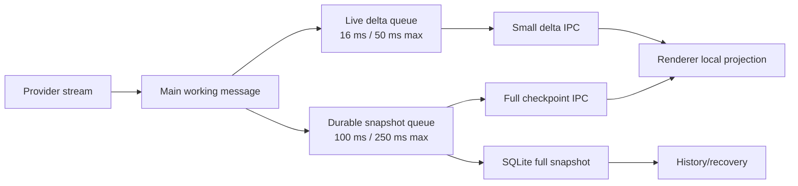

# BChat 流式背压、渲染安全与文件工具隐私设计

## 背景

`src/components/BChat/index.vue` 只是会话编排入口，流式回复容易“卡住”的主要原因位于它上下游的整条热路径：每个文本、思考或工具输入 chunk 都会触发完整 Assistant 消息克隆、同步 SQLite 序列化与写入、完整消息 IPC 广播、Renderer 全量消息替换，以及累计 Markdown 的重新解析和渲染。

这条路径没有把“用户立即看见新字符”和“消息可靠落盘”分开。回复越长，单次处理的消息越大；到达速度高于主进程持久化或 Renderer 解析速度时，工作会持续排队。即使 Provider 仍在正常返回，界面也会表现为间歇停顿。

审计还确认了几类会放大或伪装停顿的问题：

- 工具参数流对不断增长的 JSON 反复执行全量解析。
- 强制最终回答会先缓存完整文本，结束后才一次性投影。
- Markdown 单次解析不能被调度器抢占，极端嵌套可让 `marked` 栈溢出。
- 解析异常被吞掉后保留旧节点，用户只能看到内容停止更新。
- 非流式尾节点标识会随内容变化，导致 DOM 重建。
- Shell 原始输出按 chunk 直接推动消息合并。
- 现有模型流只有“连续 90 秒无 chunk”边界，持续产出但失控的超长输出或交替工具循环仍可无限消耗资源。
- `write_file` 和 `edit_file` 的工具卡片可以通过输入预览或“查看原始数据”暴露写入正文，不符合文件操作只展示目标信息的要求。

## 目标

- 将实时投影与持久化拆成两条不同频率、不同载荷的通道。
- 正常文本流在高频到达时保持有界队列和稳定帧率，不再为每个 chunk 同步写库或广播完整消息。
- 所有语义边界和终态都可靠落盘，刷新或重新进入会话后能恢复权威消息。
- Renderer 能检测乱序或缺口，并由定期完整检查点自动恢复。
- 工具参数只在完整边界解析，不对增长中的 JSON 做平方级重复工作。
- 大消息解析离开主线程；恶意或极端 Markdown 不得让气泡永久停在旧内容。
- 强制最终回答仍能过滤协议标记，同时保持真实流式展示。
- 模型输出、模型/工具续轮和 Shell 输出具备明确的资源与背压边界。
- `write_file` 与 `edit_file` 在任何状态下只显示文件名和路径，不显示写入、替换或结果正文。

## 非目标

- 不把聊天持久化改造成完整事件溯源系统。
- 不实现增量 Markdown AST 或按 token 修补 DOM。
- 不改变数据库中的消息最终结构和历史会话读取协议。
- 不移除 Chat Runtime 已有的 90 秒模型 chunk 停滞检测、工具 Watchdog、等待用户或等待外部条件语义。
- 不为文件工具新增正文预览入口、复制正文按钮或可绕过隐藏策略的调试开关。
- 不在本轮提交 Git；代码完成后由用户自行检查并提交。

## 设计原则

### 实时投影不承担耐久性

高频 delta 的职责是让当前 Renderer 尽快看到变化。它只携带最小变更，并允许合并。数据库完整快照才是恢复依据。

### 持久化不按 Provider chunk 计费

收到 chunk 时只更新主进程内存中的工作消息并标记脏状态。结构化克隆、JSON 序列化、SQLite 更新和完整消息 IPC 只在合并窗口到期或语义边界发生时执行。

### 终态必须穿透节流

工具开始/结束、等待用户、暂停、完成、失败、取消和 Runtime 清理都必须先刷新待处理实时 delta，再强制持久化最新完整快照。终态不能等待普通定时器。

### 隐私策略必须在分支入口生效

文件变更工具不能先把正文交给通用预览组件再依赖组件内部隐藏。`write_file` 与 `edit_file` 必须走独立展示分支，正文数据不得作为 Prop 传入 `ToolCode` 或带“原始数据”入口的 `ToolSummary`。

## 总体数据流



## 主进程实时投影协议

### 修订号

每条正在生成的 Assistant 消息维护一个仅在当前 Runtime 内有效的单调递增 `revision`：

- 消息创建后的完整投影使用 `revision = 0`。
- 每次工作消息发生可见变更时递增一次。
- 合并多个变更的实时事件携带合并前的 `baseRevision` 和合并后的 `revision`。
- 完整检查点携带当前 `revision`。
- 修订号不写入历史消息业务字段；它属于 Runtime 投影元数据。

实时事件使用受约束的联合类型，不传递完整消息：

```typescript
type ChatRuntimeMutation =
  | { kind: 'append-text'; partId: string; text: string }
  | { kind: 'append-reasoning'; partId: string; text: string }
  | { kind: 'append-tool-input'; toolCallId: string; text: string };

interface ChatRuntimeDeltaEvent {
  runtimeId: string;
  sessionId: string;
  messageId: string;
  baseRevision: number;
  revision: number;
  mutations: ChatRuntimeMutation[];
}
```

实际实现中的所有类型和函数按项目注释、返回类型和禁用 `any` 规范补齐。协议只允许追加型高频变更；新增 Part、状态切换、工具调用确认、工具结果和终态继续使用完整检查点，避免为所有消息结构建立脆弱的补丁语言。

### 实时合并窗口

每个 Runtime 独立维护实时 delta 队列：

- 普通等待窗口为 16 毫秒。
- 最大等待窗口为 50 毫秒，持续高频输入不能无限推迟发送。
- 同一 Part 的相邻文本或思考追加合并为一个 mutation。
- 同一工具调用的相邻输入文本合并为一个 mutation。
- mutation 数量达到 512 或累计文本达到 64 KiB 时立即刷新，防止单个 IPC 事件失控。
- 刷新实时队列只广播一次小事件，不执行数据库操作或完整消息克隆。

Electron 同一发送端与同一窗口之间保持事件顺序，但 Renderer 仍必须验证修订号，不能把传输顺序当成唯一正确性保证。

## 耐久快照与背压

### 快照合并窗口

每个 Runtime 只保留一个“最新工作消息”引用和一个脏标记：

- 普通等待窗口为 100 毫秒。
- 最大等待窗口为 250 毫秒。
- 窗口期内的新 chunk 只更新工作消息，不创建完整克隆。
- 真正刷新时才创建一次可持久化副本、一次安全 Renderer 快照，并执行一次数据库更新。
- 同一 Runtime 的快照刷新串行执行；前一次写入未结束时只保留最新脏状态，不排队保存所有中间版本。
- 保存完成后广播带 `revision` 的完整检查点，让 Renderer 校准本地投影。

这使持续流期间完整序列化、数据库写入和完整 IPC 的频率上限约为每秒 4 到 10 次，而不是 Provider chunk 数量。

### 强制刷新边界

以下变化必须按“刷新实时 delta → 持久化完整快照 → 广播完整检查点”的顺序完成：

- 新增文本、思考或工具 Part 之外的结构变化。
- `tool-input-start`、`tool-input-end`、`tool-call`、工具结果和工具失败。
- 进入或离开 `awaiting_user`、`waiting_external`、暂停或恢复状态。
- Assistant 完成、模型错误、Runtime 错误、用户停止和中止。
- Runtime 被销毁、会话切换导致执行链清理或应用正常关闭。

强制刷新使用同一个串行持久化队列，不能与普通定时刷新并发覆盖较新的快照。

### 写入失败

数据库写入失败时：

- 保留内存工作消息和最新修订号。
- 向 Renderer 广播一次安全的完整内存检查点，使当前界面不会因落盘失败停住。
- Runtime 归一化为持久化错误并走现有错误投影。
- 清除实时与快照定时器，拒绝终态后的晚到 chunk。
- 不报告保存成功，也不以旧数据库快照覆盖较新的内存终态。

## Renderer 投影与恢复

Renderer 按 `messageId` 保存最后应用的 `revision`：

- 完整检查点的修订号大于等于本地值时，用权威消息替换本地消息并更新修订号。
- delta 的 `baseRevision` 等于本地修订号时，按顺序应用 mutation，并把本地值更新为事件 `revision`。
- delta 旧于本地状态时直接忽略。
- delta 的 `baseRevision` 大于或小于本地修订号且不能连续衔接时，标记该消息等待恢复，不应用可能破坏内容的补丁。
- 等待恢复期间由下一次不超过 250 毫秒的完整持久化检查点自动校准；语义边界会更早刷新。
- 重新挂载、切换会话或漏收实时事件时先读取数据库快照，再通过后续完整检查点追上活跃 Runtime。

应用 delta 时只修改目标 Part，不重新扫描和映射所有消息 Part。Shell 展示状态的保留逻辑只在完整检查点替换时运行。

## 工具参数流

`append-tool-input` 只把文本追加到 `inputText`，不在每个 delta 上执行 `JSON.parse`：

- 输入中的工具卡片可以展示受限的 `inputText` 或现有状态，但不依赖部分 JSON 对象。
- 到达 `tool-input-end` 时尝试解析一次完整文本。
- 到达权威 `tool-call` 时以 SDK 提供的完整 `input` 为准。
- 解析失败时保留原始 `inputText` 供允许原始数据的普通工具诊断，并把结构化 `input` 保持为空；文件变更工具仍不得展示该文本。
- 单次解析错误进入诊断日志，但不能阻止后续工具结果或 Runtime 终态。

## Markdown 渲染安全

### 正确的流状态

`BubblePartText` 与 `BubblePartThinking` 必须把真实生成状态传给 `BMessage`。流式尾节点使用稳定标识，不再根据累计内容计算 key；已封存的历史块仍可使用内容哈希。

### 主线程与 Worker 分层

- 小于 32 KiB 的消息继续通过现有调度器在主线程解析，减少 Worker 通信成本。
- 达到 32 KiB 的消息交给共享 Markdown Worker 解析。
- 每次请求携带递增任务标识；较旧结果返回时丢弃，不能覆盖新文本。
- 共享 Worker 同时只执行一个解析，组件更新会结算旧订阅；Worker 完成前先展示当前纯文本，持续流不能停留在旧渲染。
- Worker 只返回可结构化克隆的节点数据，不返回函数、DOM 或 Vue 实例。
- 组件卸载时取消结果订阅；若正在执行的任务被取消则重建 Worker，但其他气泡的排队请求会继续投递。
- Worker 五秒无响应或同步投递失败时拒绝有界队列并允许下一次解析重建；旧 Worker 的晚到消息和错误不得影响替代实例。

### 复杂度防护与降级

解析前执行线性复杂度扫描：

- 连续引用、列表或混合容器的推算嵌套深度超过 128 时，不调用 `marked`，直接生成纯文本节点。
- 单条消息超过 2 MiB 时停止 Markdown 解析并使用纯文本节点，避免构建不可控 AST。
- 主线程解析或 Worker 解析抛错时记录消息标识、长度、解析路径和错误类型，不记录消息正文。
- 出错后立即显示当前完整纯文本，不能继续保留上一版渲染结果造成“假卡死”。
- 后续内容更新仍可再次走安全扫描；降级状态不会使整个会话失去响应。

调度器的 4 任务/6 毫秒预算继续用于小消息，但不再被视为长单次解析的抢占机制。

## 强制最终回答流式过滤

强制最终回答不再保存整段 `finalTextBuffer`。改为有界尾缓冲过滤器：

- 缓冲长度只覆盖最长保留协议标记及其可能的分段前缀。
- 每个 chunk 到达后立即释放已经确认不可能属于协议标记的前缀。
- `<tool_calls`、`<tool_call`、`<tool_sep`、`<arg_key`、`<arg_value` 等标记即使跨 chunk 也能被识别。
- 一旦发现禁止标记，停止投影其后的协议内容，并沿用现有违规收口逻辑。
- 正常结束时刷新剩余安全尾文本。

因此过滤器内存占用为常量级，正常最终回答仍按实时 delta 展示。

## 资源边界与失控收口

现有 90 秒无 chunk 停滞边界和工具 Watchdog 保持不变，并增加以下 Runtime 级防护：

- 单次模型步骤累计流文本最多 2 MiB；超过后中止该模型步骤并生成明确的输出过大错误。
- Provider 省略工具输入 delta 时，对权威 `tool-call.input` 做不调用访问器的有界 JSON 字节扫描，不能绕过 2 MiB 边界。
- 单次模型步骤最多接受 100,000 个流事件；超过后按异常 Provider 流收口。
- 单次用户任务最多连续执行 32 个模型/工具续轮；达到后进入需要用户确认的暂停状态，而不是直接失败。用户选择继续后开启新的 32 轮预算。
- Provider 模型配置存在 `maxOutputTokens` 时必须传入 AI SDK；未配置时不猜测模型上限，由上述字节和事件边界兜底。
- 资源错误包含稳定错误代码和计数，不包含完整生成内容或工具输入。

这些边界限制一次无人值守执行可以占用的资源，同时不恢复固定任务总墙钟。等待用户和受 Watchdog 管理的长工具不消耗模型续轮预算。

## Shell 输出背压

Shell 原始输出按 `runtimeId + toolCallId` 合并：

- 普通窗口 16 毫秒，最大等待 50 毫秒。
- 保持 stdout/stderr 到达顺序并合并相邻文本。
- 工具结束、失败、中止或会话清理前强制刷新。
- Renderer 现有 80 chunk / 12,000 字符展示上限继续生效。
- 终端持久化快照仍使用既有 `lodash-es` 防抖策略，不能引入第二套相互竞争的计时器。

## 文件变更工具隐私展示

### 展示规则

`src/components/BChat/components/MessageBubble/BubblePartTool/index.vue` 对 `write_file` 和 `edit_file` 使用独立分支，展示内容固定为：

- 文件名：从目标路径最后一个有效路径段派生，同时兼容 `/` 与 `\\` 分隔符。
- 文件路径：展示完整目标路径。

目标路径按以下优先级解析：

1. `part.input.path`。
2. 成功或失败结果中受信任的结构化 `path`。
3. 无法解析时显示现有未知路径占位，不回退展示原始对象。

完成状态下继续保留现有“打开文件”能力，但可点击载荷只能是解析后的路径。输入中或执行中只展示目标，不触发打开操作。

### 永久隐藏字段

文件变更工具在 `inputting`、`executing`、`done`、失败和取消状态下都不得渲染或传递下列内容到通用预览：

- `content`
- `oldString`
- `newString`
- `inputText`
- 结果中的正文、差异、原始输入或原始输出

该分支不渲染 `ToolCode`，不使用带“查看原始数据”的 `ToolSummary`，也不提供展开后绕过隐藏的入口。其他工具继续保留现有摘要与原始数据行为。

建议新增职责单一的 `ToolFileTarget.vue`，只接收已经净化的 `fileName`、`filePath` 和可选打开事件。它不接收整个 Tool Part、input 或 result，类型层面避免以后误把正文传入。

## 定时器、取消与生命周期

- 实时 delta、快照和 Shell 合并器都必须提供 `flush` 与 `cancel`。
- 正常终态先 `flush`，再 `cancel` 并释放引用。
- 错误或强制中止尽力刷新安全终态；已关闭 Runtime 的晚到回调只丢弃，不得重新创建定时器。
- Renderer 卸载时移除 Runtime 事件订阅、Markdown 任务订阅和文件打开事件监听。
- 测试使用可注入时钟或假定时器验证普通等待、最大等待、强制刷新和清理，不依赖真实睡眠。

## 实施边界

实现按以下依赖顺序推进，每一步先补失败测试：

1. 建立 delta、修订号、实时/快照合并器和纯单元测试。
2. 接入主进程流执行器、Chat Runtime Service、IPC 类型和 Preload。
3. 接入 Renderer 局部投影、缺口恢复和稳定尾节点。
4. 移除工具参数逐 chunk JSON 解析，改为边界解析。
5. 实现 Markdown Worker、安全扫描与纯文本降级。
6. 改造强制最终回答为有界尾缓冲过滤器。
7. 增加模型步骤、续轮和 Shell 输出背压边界。
8. 实现文件变更工具专用目标展示并移除所有正文入口。
9. 运行专项、全量类型、代码和样式验证，检查工作区差异，不创建提交。

## 测试策略

### 主进程流与持久化

- 1,000 个文本 chunk 在合并窗口内只产生有界数量的 delta 与完整数据库写入。
- 100/250 毫秒窗口、连续高频输入和串行慢写场景均只保留最新待保存状态。
- 文本、思考和工具输入 mutation 合并后保持原始顺序与内容。
- 每个语义边界和终态都会先刷新 delta，再保存完整快照。
- 保存失败、取消和终态晚到 chunk 不会复活 Runtime 或覆盖新状态。
- `revision` 连续递增，不因合并丢失最终内容。

### Renderer 投影

- 连续 delta 只更新目标 Part。
- 旧 revision 被忽略，缺口 delta 被拒绝，下一完整检查点可以恢复。
- 会话重新挂载期间遗漏事件后可由历史快照和活跃检查点收敛。
- Shell 本地展示状态在完整检查点替换时仍被保留。
- 文本与思考气泡收到真实流状态，尾节点 key 在追加时保持稳定。

### 工具输入与最终回答

- 工具 JSON 分成任意 chunk 时只在输入结束或权威调用边界解析。
- 无效 JSON 不阻止工具失败、结果或 Runtime 终态。
- 强制最终回答首个安全文本可在流结束前出现。
- 每个禁止协议标记按字符边界切分时都能识别，正常尾文本不会丢失。

### Markdown

- 小消息继续使用主线程调度，大消息使用 Worker。
- 旧 Worker 结果不能覆盖新文本，卸载组件不接收结果。
- 4,000 层引用、4,000 层列表、超过 2 MiB 输入和模拟解析异常均降级为当前纯文本，不抛出未处理异常，也不保留旧渲染。
- 日志不包含消息正文。

### 资源与 Shell

- 文本字节、流事件和 32 续轮边界分别产生稳定收口行为。
- 用户确认继续后续轮预算重置，长工具等待不消耗预算。
- Shell 高频 chunk 保持顺序、按窗口合并，并在完成前刷新。
- 清理后无残留计时器或晚到输出。

### 文件工具隐私

- `write_file` 在输入中、执行中、成功和失败状态只显示文件名与路径。
- `edit_file` 在输入中、执行中、成功和失败状态只显示文件名与路径。
- 测试注入唯一敏感字符串到 `content`、`oldString`、`newString`、`inputText` 和结果正文，渲染文本与 HTML 均不得包含这些字符串。
- 文件变更工具不显示“查看原始数据”，也不挂载 `ToolCode`。
- 完成后的有效路径仍能触发现有打开文件行为；未知路径不会触发打开。
- 非文件变更工具的摘要、原始数据和交互行为不变。

## 验证命令

实现完成后至少执行：

```bash
pnpm exec vitest run test/electron/main/modules/chat/runtime/stream test/electron/main/modules/chat/runtime test/components/BChat test/components/BMessage --reporter=dot
pnpm exec tsc --noEmit
pnpm exec eslint src electron test --ext .vue,.ts,.tsx,.js,.jsx,.mts
pnpm exec stylelint 'src/**/*.{vue,less,css}'
```

若仓库脚本的实际检查范围与上述命令不同，以 `package.json` 中现有脚本为准补跑 `pnpm lint` 与 `pnpm lint:style`。所有代码改动同时记录到 `changelog/2026-08-10.md`。

## 验收标准

1. 高频流不再对每个 Provider chunk 执行完整消息克隆、同步数据库写入和完整消息 IPC。
2. 正常持续流的实时 delta 最大合并等待不超过 50 毫秒，耐久完整检查点最大合并等待不超过 250 毫秒。
3. 任意完成、失败、停止或工具语义边界后，数据库与 Renderer 最终消息一致。
4. Renderer 遇到旧事件或修订缺口不会破坏消息，并能由下一完整检查点恢复。
5. 工具输入不会随每个 delta 重复解析增长中的 JSON。
6. 大型或极端 Markdown 不阻塞主线程，不因异常永久显示旧内容。
7. 强制最终回答保持流式可见，并继续阻止跨 chunk 的协议标记泄漏。
8. 输出、续轮与 Shell 高频事件都具有可测试的有界背压和清理行为。
9. `write_file` 与 `edit_file` 的卡片在所有状态只展示文件名和路径，任何写入、替换、差异或结果正文都不可见。
10. 专项测试、TypeScript、ESLint 与 Stylelint 检查通过，且未创建 Git 提交。
