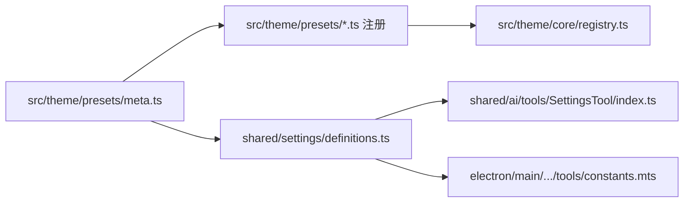

# 设置与主题预设元数据共享设计

## 背景

新增内置主题预设时，当前需要在 `src/theme` 完成预设注册，同时还要手动更新 `shared/ai/tools/SettingsTool/index.ts` 中 `themePreset` 的自然语言值域说明。设置键也在 shared registry 与主进程工具常量中各维护一份，容易漂移。

## 目标

- 新增主题后无需修改 `SettingsTool` 的主题预设说明。
- 抽出设置键与设置说明元数据，作为 AI 设置工具和主进程设置工具的共享配置。
- 保持 `src/theme` 是主题预设事实源，不让 shared tool registry 依赖 renderer-only alias 或运行时注册副作用。
- 不改变 `get_settings` / `update_settings` 的外部 schema 形状和执行语义。

## 方案

新增 `src/theme/presets/meta.ts`，维护内置主题预设的纯元数据：

```ts
interface BuiltinThemePresetMeta {
  id: string;
  label: string;
  description: string;
}
```

每个 `src/theme/presets/*.ts` 注册时复用对应 meta 的 `id` 和 `label`。`description` 面向 AI 工具值域说明，用短语描述整套主题氛围。这个文件不导入 token、DOM、Vue 或 registry，因此可以被 shared 代码安全复用。

新增 `shared/settings/definitions.ts`，集中维护：

- `SUPPORTED_SETTING_KEYS`
- `SupportedSettingKey`
- 每个设置项的 `summary`
- 每个设置项的值域说明
- `formatSettingSummaryDescription()`
- `formatSettingValueDescription()`

`themePreset` 的值域说明由 `BUILTIN_THEME_PRESET_META` 自动生成，例如 `default=白/浅灰/黑灰`。`shared/ai/tools/SettingsTool/index.ts` 只负责组装工具 registry，主进程 `electron/main/modules/chat/runtime/tools/constants.mts` 从共享定义导出 `SUPPORTED_SETTING_KEYS`。

## 数据流



## 测试

- 更新 `test/ai/tools/tool-registry.test.ts`，验证 `SettingsTool` 说明来自共享定义，并包含当前主题 meta 生成的值域。
- 新增或扩展主题预设测试，验证每个内置预设 meta 都能在 `getPresetList()` 中找到同 ID 和 label。
- 运行聚焦测试：`pnpm exec vitest run test/ai/tools/tool-registry.test.ts test/theme/preset-list.test.ts`。
- 视情况运行 `pnpm exec tsc --noEmit` 确认 shared / electron 类型边界。

## 风险与边界

- 不把完整 token 移到 shared，避免主进程或工具 registry 意外引入主题注册副作用。
- 不把 `update_settings` 的 JSON schema enum 动态扩展为 theme preset ID；当前 value 仍为 `string | boolean`，实际 themePreset 合法性继续由 renderer 侧 `getPresetList()` 校验。
- 自定义主题不进入 AI 工具静态说明。`get_settings` 可以返回当前自定义 preset ID，`update_settings` 是否接受仍由运行时注册表决定。
