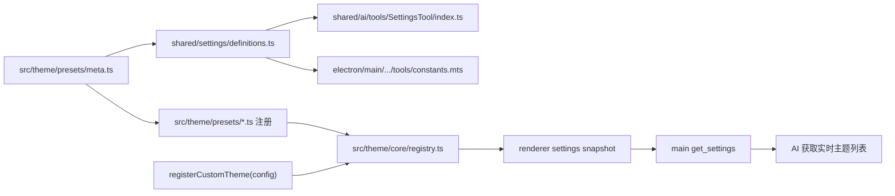

# 设置与主题预设元数据共享设计

## 背景

新增内置主题预设时，当前需要在 `src/theme` 完成预设注册，同时还要手动更新 `shared/ai/tools/SettingsTool/index.ts` 中 `themePreset` 的自然语言值域说明。设置键也在 shared registry 与主进程工具常量中各维护一份，容易漂移。

## 目标

- 新增主题后无需修改 `SettingsTool` 的主题预设说明。
- 抽出设置键与设置说明元数据，作为 AI 设置工具和主进程设置工具的共享配置。
- 保持 `src/theme` 是主题预设事实源，不让 shared tool registry 依赖 renderer-only alias 或运行时注册副作用。
- 内置主题与未来用户自定义主题都能被 AI 查询和选择。
- 保持 `get_settings` / `update_settings` 的输入 schema 不变，仅扩展 `get_settings` 的返回数据。

## 方案

新增 `src/theme/presets/meta.ts`，维护内置主题预设的纯元数据：

```ts
interface BuiltinThemePresetMeta {
  id: string;
  label: string;
  description: string;
}
```

每个 `src/theme/presets/*.ts` 注册时复用对应 meta 的 `id` 和 `label`。`description` 面向 AI 工具值域说明，用短语描述整套主题氛围。这个文件不导入 token、DOM、Vue 或 registry，因此可以被 shared 代码安全复用。

新增 `shared/settings/definitions.ts`，集中维护：

- `SUPPORTED_SETTING_KEYS`
- `SupportedSettingKey`
- 每个设置项的 `summary`
- 每个设置项的值域说明
- `formatSettingSummaryDescription()`
- `formatSettingValueDescription()`

`themePreset` 的值域说明由 `BUILTIN_THEME_PRESET_META` 自动生成，例如 `default=白/浅灰/黑灰`。`shared/ai/tools/SettingsTool/index.ts` 只负责组装工具 registry，主进程 `electron/main/modules/chat/runtime/tools/constants.mts` 从共享定义导出 `SUPPORTED_SETTING_KEYS`。

## 运行时主题发现

共享元数据只描述随应用发布的内置主题，不能承载用户运行时创建的主题。未来自定义主题继续通过 `registerCustomTheme(config)` 注册到现有 theme registry，与内置主题使用同一套 `getPresetList()` 查询接口。

renderer 生成设置快照时，将 registry 的实时列表附加到返回值：

```ts
interface RuntimeSettingsSnapshot {
  settings: Partial<Record<RuntimeSettingKey, RuntimeSettingValue>>;
  themePresetOptions: Array<{
    id: string;
    label: string;
  }>;
}
```

`get_settings` 在请求包含 `themePreset`，或未传 `keys` 获取全部设置时，返回 `themePresetOptions`。这个列表同时包含内置主题和当前已注册的自定义主题，因此 AI 可以先读取当前可选项，再使用对应 ID 调用 `update_settings`。

内置主题仍在工具静态说明中展示简短氛围描述，帮助 AI 直接理解应用自带主题。静态说明同时明确：实际可用 ID 以 `get_settings` 返回的 `themePresetOptions` 为准。自定义主题不写入静态工具 schema，也不需要重建工具 registry。

当 `update_settings` 修改 `themePreset` 时，主进程使用同一次设置快照中的 `themePresetOptions` 在弹出确认前校验 ID；renderer 应用设置时继续通过 theme registry 做最终校验。这样可以阻止未知 ID，同时避免主进程复制主题注册逻辑。

## 数据流



内置主题的数据路径有两条：纯元数据生成静态工具说明，运行时注册表生成实时可选项。自定义主题只走运行时注册表路径，因此用户主题的增删改无需触碰 shared 工具定义。

## 错误处理

- `themePresetOptions` 由 registry 生成；bridge 类型守卫要求每项都有非空 `id` 和 `label`。
- `update_settings` 收到未知主题 ID 时，在用户确认前返回 `INVALID_INPUT`，并提示先调用 `get_settings` 获取当前可选项。
- renderer 保留现有 `getPresetList()` 校验，防止快照生成后主题被删除或运行时状态发生变化。
- 未知 preset 的 token fallback 行为保持不变，但 AI 设置写入不能依赖 fallback 掩盖非法 ID。

## 测试

- 更新 `test/ai/tools/tool-registry.test.ts`，验证 `SettingsTool` 说明来自共享定义，并包含当前主题 meta 生成的值域。
- 新增或扩展主题预设测试，验证每个内置预设 meta 都能在 `getPresetList()` 中找到同 ID 和 label。
- 扩展 renderer settings snapshot 测试，验证注册自定义主题后 `themePresetOptions` 同时包含内置和自定义主题。
- 扩展主进程设置工具测试，验证 `get_settings` 返回实时主题列表、`update_settings` 接受列表内的自定义 ID，并在确认前拒绝未知 ID。
- 运行聚焦测试：`pnpm exec vitest run test/ai/tools/tool-registry.test.ts test/theme/preset-list.test.ts`。
- 运行 settings bridge 与主进程工具相关测试。
- 运行 `pnpm exec tsc --noEmit` 确认 shared / electron 类型边界。

## 风险与边界

- 不把完整 token 移到 shared，避免主进程或工具 registry 意外引入主题注册副作用。
- 不把 `update_settings` 的 JSON schema enum 动态扩展为 theme preset ID；当前 value 仍为 `string | boolean`，主进程按快照预检，renderer 再通过 `getPresetList()` 做最终校验。
- 不动态重建 SettingsTool schema；工具定义保持稳定，运行时可选项通过 `get_settings` 数据返回。
- 本次不实现自定义主题编辑、持久化或管理 UI，只确保未来通过 `registerCustomTheme()` 注册的主题能沿同一数据路径被 AI 发现和选择。
