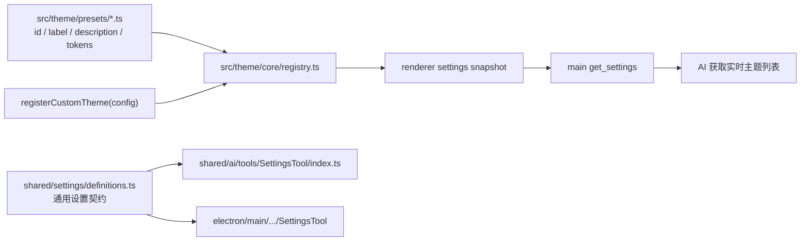

# 设置与主题预设元数据共享设计

## 背景

新增内置主题预设时，当前需要在 `src/theme` 完成预设注册，同时还要手动更新 `shared/ai/tools/SettingsTool/index.ts` 中 `themePreset` 的自然语言值域说明。设置键也在 shared registry 与主进程工具常量中各维护一份，容易漂移。

## 目标

- 新增主题后无需修改 `SettingsTool` 的主题预设说明。
- 抽出设置键与设置说明元数据，作为 AI 设置工具和主进程设置工具的共享配置。
- 保持 `src/theme` 是主题预设事实源，每个预设直接拥有自己的名称和氛围描述。
- 保持 `shared/ai/tools` 作为跨进程工具 registry，不为 SettingsTool 建立 renderer 特例。
- 内置主题与未来用户自定义主题都能被 AI 查询和选择。
- 保持 `get_settings` / `update_settings` 的输入 schema 不变，仅扩展 `get_settings` 的返回数据。

## 方案

扩展 `src/theme/core/registry.ts` 的 `ThemePreset`，让主题描述与 token 注册保持在同一个预设文件中：

```ts
interface ThemePreset {
  id: string;
  label: string;
  description: string;
  light: ThemeTokens;
  dark: ThemeTokens;
}
```

每个 `src/theme/presets/*.ts` 在调用 `registerPreset()` 时直接声明 `id`、`label` 和 `description`。不新增独立的主题元数据常量，也不让 shared 设置定义导入 `src/theme`。

`CustomThemeConfig` 增加可选 `description`。自定义主题没有提供描述时，registry 使用 `label` 作为回退，确保运行时选项始终拥有可读说明。

新增 `shared/settings/definitions.ts`，集中维护：

- `GET_SETTINGS_TOOL_NAME` / `UPDATE_SETTINGS_TOOL_NAME`
- `SUPPORTED_SETTING_KEYS`
- `SupportedSettingKey`
- 每个设置项的 `summary`
- 与主题清单无关的通用值域说明
- `formatSettingSummaryDescription()`
- `formatSettingValueDescription()`

`themePreset` 的静态值域说明只要求使用 `get_settings` 返回的实时 `themePresetOptions`，不枚举任何内置主题。`shared/ai/tools/SettingsTool/index.ts` 继续负责组装跨进程 registry 条目，但只消费这份通用设置定义。

SettingsTool 不下沉到 `src/ai/tools/builtin`。shared registry 同时驱动 renderer 默认暴露策略、schema-only 工厂和 Electron 主进程工具分组；移动单个工具会迫使这些链路分别维护例外，破坏当前 registry 的单一来源。

`electron/main/modules/chat/runtime/tools/constants.mts` 不导入或导出 `SUPPORTED_SETTING_KEYS`。`types.mts`、`guards.mts` 和主进程 SettingsTool 直接从 `shared/settings/definitions.ts` 导入设置契约。

## 运行时主题发现

内置主题和未来自定义主题都通过现有 theme registry 注册，并使用同一套 `getPresetList()` 查询接口。`getPresetList()` 返回 ID、显示名称和氛围描述。

renderer 生成设置快照时，将 registry 的实时列表附加到返回值：

```ts
interface RuntimeSettingsSnapshot {
  settings: Partial<Record<RuntimeSettingKey, RuntimeSettingValue>>;
  themePresetOptions: Array<{
    id: string;
    label: string;
    description: string;
  }>;
}
```

`get_settings` 在请求包含 `themePreset`，或未传 `keys` 获取全部设置时，返回 `themePresetOptions`。这个列表同时包含内置主题和当前已注册的自定义主题，因此 AI 可以先读取当前可选项，再使用对应 ID 调用 `update_settings`。

SettingsTool 静态说明不包含主题清单，实际可用 ID、名称和描述统一以 `get_settings` 返回的 `themePresetOptions` 为准。自定义主题不写入静态工具 schema，也不需要重建工具 registry。

当 `update_settings` 修改 `themePreset` 时，主进程使用同一次设置快照中的 `themePresetOptions` 在弹出确认前校验 ID；renderer 应用设置时继续通过 theme registry 做最终校验。这样可以阻止未知 ID，同时避免主进程复制主题注册逻辑。

## 数据流



主题信息只走运行时 registry 路径。SettingsTool 只定义如何读取和修改设置，不拥有任何具体主题知识，因此内置或用户主题的增删改都无需触碰 shared 工具定义。

## 错误处理

- `themePresetOptions` 由 registry 生成；bridge 类型守卫要求每项都有非空 `id`、`label` 和 `description`。
- `update_settings` 收到未知主题 ID 时，在用户确认前返回 `INVALID_INPUT`，并提示先调用 `get_settings` 获取当前可选项。
- renderer 保留现有 `getPresetList()` 校验，防止快照生成后主题被删除或运行时状态发生变化。
- 未知 preset 的 token fallback 行为保持不变，但 AI 设置写入不能依赖 fallback 掩盖非法 ID。

## 测试

- 更新 `test/ai/tools/tool-registry.test.ts`，验证 `SettingsTool` 说明来自共享定义、不硬编码主题 ID，并提示读取实时 `themePresetOptions`。
- 扩展主题预设测试，验证每个内置预设都直接注册非空 `description`，且不存在独立 meta 清单。
- 扩展 renderer settings snapshot 测试，验证注册自定义主题后 `themePresetOptions` 同时包含内置和自定义主题的描述。
- 扩展主进程设置工具测试，验证 `get_settings` 返回实时主题列表、`update_settings` 接受列表内的自定义 ID，并在确认前拒绝未知 ID。
- 更新 Electron 常量测试，验证 `constants.mts` 不再承担设置键的导入导出。
- 运行聚焦测试：`pnpm exec vitest run test/ai/tools/tool-registry.test.ts test/theme/preset-list.test.ts`。
- 运行 settings bridge 与主进程工具相关测试。
- 运行 `pnpm exec tsc --noEmit` 确认 shared / electron 类型边界。

## 风险与边界

- 不把完整 token 移到 shared，避免主进程或工具 registry 意外引入主题注册副作用。
- 不把 `update_settings` 的 JSON schema enum 动态扩展为 theme preset ID；当前 value 仍为 `string | boolean`，主进程按快照预检，renderer 再通过 `getPresetList()` 做最终校验。
- 不动态重建 SettingsTool schema；工具定义保持稳定，运行时可选项通过 `get_settings` 数据返回。
- 不把 SettingsTool 下沉到 renderer builtin，避免拆散跨进程工具 registry、暴露策略和主进程路由。
- 本次不实现自定义主题编辑、持久化或管理 UI，只确保未来通过 `registerCustomTheme()` 注册的主题能沿同一数据路径被 AI 发现和选择。
